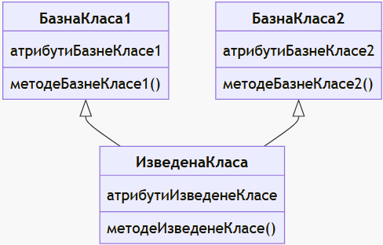

# Наслеђивање

Наслеђивање је основни концепт у објектно-оријентисаном програмирању којим се
омогућава креирање нових класа из постојећих класа. Класа из које се наслеђује
назива се **базна** класа (енгл. *base class*), а класа која наслеђује базну
класу назива се **изведена** класа (енгл. *derived class*). У изведеној класи
наслеђују се чланови базне класе, а могу се дефинисати и нови чланови или
променити постојећи. Наслеђивање омогућава поновну употребу кода и његову
организацију на логичан начин, на пример у виду хијерархијске структуре класа
тј. стабла класа. Овој теми биће посвећено једно цело поглавље. У литератури
на српском језику, "базна класа" назива се и "основна класа", "надкласа" или
"родитељска класа", док се "изведена класа" назива и "наслеђена класа",
"поткласа" или "класа потомка".

Једноставан пример хијерархије класа за твоју школу могао би да изгледа овако:

Школу похађају ученици, а у школи раде запослени. Запослени могу бити
наставници или ненаставно особље. Заједничко за све особе у школи је да имају
име и годину рођења. За ученике је битно навести у којем су одељењу. За све
запослене битно је навести године стажа и степен стручне спреме. За наставника
поред тога треба навести и предмет који предаје, а за ненаставно особље који
посао обављају.

Посматрај једну изведену класу на дијаграму, на пример класу `Nastavnik`. Она
је изведена из класе `Zaposleni`, а класа `Zaposleni` из класе `Osoba`. У
изведеној класи `Nastavnik`, наслеђени су чланови класа који се у хијерархији
наслеђивања налазе изнад ње.

Из овог примера можеш да закључиш да наслеђивање омогућава поновну употребу
постојећег кода, што смањује дуплирање кода и убрзава развој. Нове
функционалности могу да се додају у изведене класе без потребе за изменом
постојећих класа, што олакшава одржавање и проширење система.

Такође, наслеђивање омогућава логичку организацију класа, тј. хијерархију класа,
што побољшава читљивост и структуру кода.

У различитим програмским језицима постоје различити типови наслеђивања класа:

**једноструко наслеђивање**: изведена класа наслеђује једну базну класу (најчешћи
облик наслеђивања, једноставан за управљање):

**вишеструко наслеђивање**: изведена класа истовремено наслеђује више базних
класа (сложена структура, потенцијални конфликти, C# не подржава вишеструко
наслеђивање класа):

**вишесложно наслеђивање**: једна изведена класа је наслеђена из друге изведене
класа (чест облик наслеђивања):

У дијаграму изнад, `БазнаКласа` је базна класа за `ИзведенаКласа1`, а
`ИзведенаКласа1` је базна класа за `ИзведенаКласа2`.

**хијерархијско наслеђивање**: једна базна класа је базна класа за више
изведених класа (чест облик наслеђивања):

У дијаграму изнад, `БазнаКласа` је базна класа и за `ИзведенаКласа1` и за
`ИзведенаКласа2`.

**хибридно наслеђивање**: подразумева комбинацију више типова наслеђивања.
