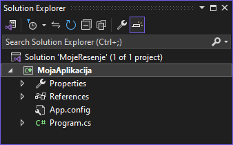
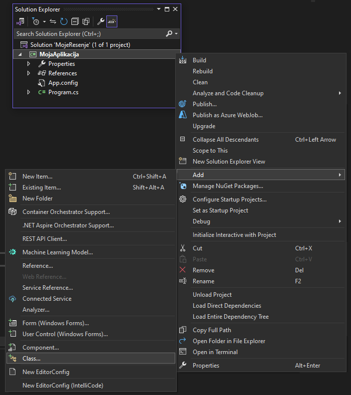
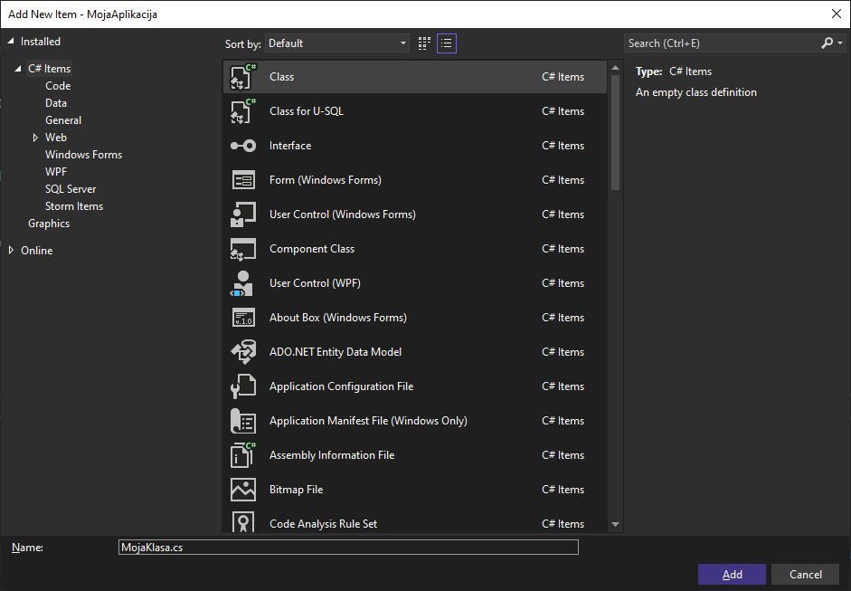
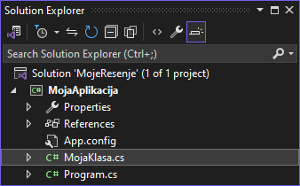

# Додавање нове класе у пројекат

На почетку је речено да је класа `Program` место где се поставља почетна логика
програма и да је за веће апликације препоручљиво да се логика распореди у
више класа, а да класа `Program` садржи само кôд за иницијализацију и покретање
апликације. Додатне класе можеш дефинисати у истом `.cs` фајлу у којем се
налази и класа `Program`, али ако је број и садржај тих класа велик, фајл ће
постати јако непрегледан. Решење је да додатне класе у оквиру истог пројекта
дефинишеш у засебним фајловима. Ова пракса је кључна за одржавање чистог,
организованог и скалабилног кода.

Када су класе у засебним фајловима, сваки фајл има јасну и одређену сврху. Ово
олакшава читање и разумевање кода, како за тебе, тако и за друге који раде на
истом пројекту. Раздвајање класа у више фајлова омогућава бржу навигацију кроз
пројекат. Можеш лакше пронаћи и модификовати одређену класу без потребе да се
крећеш (скролујеш) кроз велики фајл који садржи више класа. Пројекат који је
организован са класама у засебним фајловима изгледа уредније и професионалније.
Именски простори и структуре директоријума могу се користити за додатну
организацију, што чини пројекат јаснијим и структуриранијим.

Када су класе у засебним фајловима, лакше је поново користити те класе у другим
пројектима. Можеш брзо идентификовати класе које су опште намене и које можеш
искористити у различитим контекстима. У системима за контролу верзија (као што
је *Git*), промене у засебним фајловима су јасније и лакше за праћење. Ако се
све класе налазе у истом фајлу, конфликтне промене су чешће и теже за решавање.

Додавање нове класе у пројекат је једноставно и интуитивно. У Solution Explorer
прозору...

...кликни десним кликом на назив пројекта (у овом примеру `MojaAplikacija`),
па одабери `Add`, па `Class`:

Именуј фајл, односно класу, на пример `MojaKlasa.cs`...

...па кликни `Add`. Овим поступком си додао класу `MojaKlasa` у свој пројекат
у засебном фајлу:

