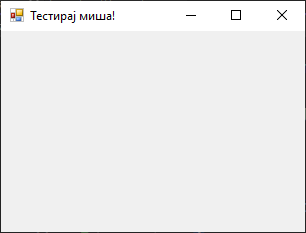
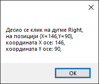

# Догађаји миша

У *Windows Forms App (.NET Framework)* пројектима и у GUI апликацијама уопште,
догађаји миша играју кључну улогу у интеракцији корисника са апликацијом. Ови
догађаји омогућавају апликацији да реагује на различите акције корисника мишем,
као што су кликови, померање показивача миша, притисци на дугмад миша и сл.

Пре него што се упознаш са догађајима миша, важно је да знаш називе константи
којима се дефинише које је дугме миша притиснуто:

| Дугме    | Опис                                       |
|----------|--------------------------------------------|
| Left     | Притиснуто је лево дугме миша.             |
| Middle   | Притиснуто је средње дугме миша.           |
| None     | Није притиснуто ни једно дугме миша.       |
| Right    | Притиснуто је десно дугме миша.            |
| XButton1 | Притиснуто је прво специјално дугме миша.  |
| XButton2 | Притиснуто је друго специјално дугме миша. |

Специјална дугмад миша представљају два дугмета која се налазе са стране на
мишу *Microsoft IntelliMouse Explorer*. Данас их поседује већина мишева.
Ове дефиниције дате су у енумерацији `MouseButtons Enum` у именском простору
`System.Windows.Forms`, односно склопу `System.Windows.Forms.dll`.

Основни догађаји миша у *Windows Forms App (.NET Framework)* пројектима су:

* `MouseClick` - јавља се када се мишем кликне на контролу,
* `MouseDoubleClick` - јавља се када се мишем двапут кликне на контролу,
* `MouseDown` - јавља се када је показивач миша изнад контроле и када се
притисне дугме миша,
* `MouseUp` - јавља се када је показивач миша изнад контроле и када се
пусти дугме миша,
* `MouseEnter` - јавља се када показивач миша уђе у контролу,
* `MouseLeave` - јавља се када показивач миша изађе из контроле,
* `MouseHover` - јавља се када показивач миша налази изнад контроле,
* `MouseMove` - јавља се када показивач миша помера изнад контроле,
* `MouseWheel` - јавља се када се точкић миша помера док је контрола у фокусу.

У ранијим примерима дефинисао си догађај клика на форму `Click`. Може се рећи
да је догађај `Click` на вишем нивоу апстракције догађаја који се покреће када
корисник кликне на контролу. Он се покреће након што се успешно обраде сви нижи
нивои догађаја као што су `MouseDown` и `MouseUp`, и то када су оба догађаја
завршена над истом контролом. `Click` догађај је користан за већину случајева
када желиш да реагујеш на једноставан клик корисника, без обзира које је дугме
миша притиснуто. Исто важи и за догађај `DoubleClick`.

С друге стране, догађај `MouseClick` је догађај нижег нивоа који се специфично
односи на акције миша. Овај догађај се покреће када се догоди низ догађаја
`MouseDown` и `MouseUp` над истом тачком на контроли, приликом чега можеш
разликовати које је дугме миша притиснуто. `MouseClick` догађај је користан
када је потребно да знаш које је тачно дугме мише притиснуто, или када желиш да
имаш додатну контролу над понашањем миша.

## Задатак

Креирај нови *Windows Forms App (.NET Framework)* пројекат са једном формом
димензија 320×240 и текстом "Тестирај дугмад миша!" у насловној линији форме.



Апликација треба да обавештава порукама корисника којим је тастером миша
кликнуо на форму, као и о позицији тачке на форми коју је кликнуо у односу на
горњи леви угао форме.

Кликни на форму и дефиниши догађај `MouseClick`:

```cs
private void Form1_MouseClick(object sender, MouseEventArgs e)
{
    MessageBox.Show("Десио се клик на дугме " + e.Button.ToString() + "," +
    "\r\nна позицији " + e.Location + "," +
    "\r\nкоордината X осе: " + e.X + "," +
    "\r\nкоордината Y осе: " + e.Y + ",");
}
```

Када покренеш апликацију и кликнеш на форму, на пример десним дугметом миша,
добићеш поруку о томе:


