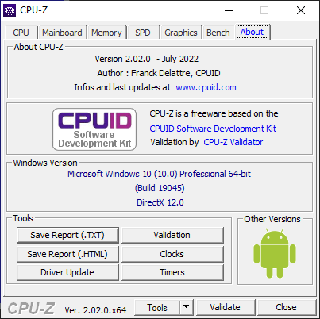

# Дугме

Контрола дугме (енгл. *Button*) дефинисана је у класи `Button` која се налази у
именском простору `System.Windows.Forms`, односно склопу
`System.Windows.Forms.dll`. Класа `Button` наслеђује класу `ButtonBase` која
наслеђује класу `Control`, па због тога дугме има основна својства, догађаје и
методе као и остале контроле у *Windows Forms App* пројектима.

Детаљан опис својстава, догађаја и метода класе `Button` налази се у званичној
[документацији](https://learn.microsoft.com/en-us/dotnet/api/system.windows.forms.button?view=netframework-4.8).
Има их много и нема потребе наводити их све на овом месту.

Дугме представља једну од основних контрола у десктоп апликацијама. Можеш га
користити за обављање многих радњи у складу са захтевима. Својствима дугмета
можеш детаљно дефинисати изглед и положај дугмета на форми. Неке од основних
својстава дугмета која ћеш често користити су:

* `Text`. Одређује текст у контроли.
* `TextAlign`. Одређује поравнање текста унутар контроле.
* `Enabled`. Одређује да ли је дугме омогућено за интеракцију.
* `BackColor` и `ForeColor`. Одређује боју текста и боју позадине текста.
* `FlatStyle`. Одређује визуелни стил приказа дугмета.

Дугме учествује у редоследу картица (енгл. *TAB order*) у којем добија свој
индекс (`TabIndex`) и фокус (`TabStop`), па према томе, дугме може да се кликне
мишем, а ако је у фокусу, тастерима `ENTER` и `SPACE`.

Најчешћи догађај дугмета је догађај клика мишем `Click`, а доступни су и сви
остали догађаји. Пример коришћења дугмета на форми може бити апликација из
претходне лекције...



...где је у трећем оквиру постављено шест дугмади и у десном доњем углу два
стандардна дугмета.

Контролу дугме можеш поставити, односно приказати на форми на два начина:

* помоћу дизајнера у току израде апликације (енгл. *Design-Time*) или
* мануелно програмским кодом у току извршавања апликације (енгл. *Run-Time*).

Нека је задатак да креираш Windows Forms Apps (.NET Framework) пројекат са
једном формом димензија 320×240 која нема оквире нити дугмад Minimize, Maximize
и Close у горњем десном углу. На форму треба да поставиш:

* једну лабелу са текстом **Да ли волиш програмирање?**
* једно дугме са текстом **Да** и
* једно дугме са текстом **Не**.

Положај, величину, изглед и визуелни стил приказа дугмади одреди сам. Кликом
на дугме **Да** у дну треба да се појави лабела са текстом
**Посети `www.petlja.org`!** и дугме **Затвори**. Кликом на дугме **Не** треба
да искочи порука са текстом **Погрешан одговор!**, а кликом на динамички
креирано дугме **Затвори**, апликација треба да се затвори.

## Креирање и постављање својстава дугмади дизајнером

Као и у случају лабела, када постављаш дугмад помоћу дизајнера, подразумевана
имена `button1`, `button2` итд., треба да промениш у нека смислена имена, на
пример `btnDa` и `btnNe`. Форма са постављеним контролама може да изгледа на
пример овако:


Обрати пажњу да је на слици у фокусу прво дугме, јер је његов `TabIndex`
постављен на `1`. Притиском на тастер `TAB` на тастатури фокус прелази на друго
дугме чији је `TabIndex` постављен на `2`. Пошто апликација нема дугме `Close`
у горњем десном углу, можеш је затворити комбинацијом тастера `ALT` и `F4`.

## Догађаји дугмета и динамичко креирање дугмета

Кликом на прво дугме потребно је да креираш динамички једну лабелу и једно
дугме. Динамичко креирање лабеле научио си у претходној лекцији, а динамичко
креирање дугмета имплементираћеш по истом принципу:

```cs
private void btnDa_Click(object sender, EventArgs e)
{
    Label lblPosetiPetlju = new Label();
    lblPosetiPetlju.Text = "Посети www.petlja.org!";
    lblPosetiPetlju.Location = new Point(60, 130);
    lblPosetiPetlju.AutoSize = true;
    lblPosetiPetlju.Font = new Font("Arial", 14);
    this.Controls.Add(lblPosetiPetlju);
    
    Button btnIzlaz = new Button();
    btnIzlaz.Text = "Излаз";
    btnIzlaz.Location = new Point(120, 160);
    btnIzlaz.AutoSize = true;
    btnIzlaz.TabIndex = 3;
    this.Controls.Add(btnIzlaz);
}
```

Сада ће апликација изгледати овако након клика на прво дугме:


## Креирање руковаоца догађајем

Питање је како дефинисати догађај клика на динамички креирано дугме, када то
дугме не постоји током дизајна, нити може да се референцира? Одговор лежи у
руковаоцима догађаја. Потребно је да мануелно напишеш код за догађај клика на
динамички креирано дугме, на пример овако...

```cs
private void BtnIzlaz_Click(object sender, EventArgs e)
{
    Application.Exit();
}
```

...па догађају `Click` за котролу `btnIzlaz` додаш тај догађај помоћу руковаоца
догађаја. Значи, после креирања објекта `btnIzlaz`, а пре додавања контроле
`btnIzlaz` на форму потребно је да додаш још једну линију кода:

```cs
btnIzlaz.Click += new EventHandler(BtnIzlaz_Click);
```

На крају треба да реализујеш испис поруке са текстом **Погрешан одговор!** када
се кликне на дугме **Не**.
