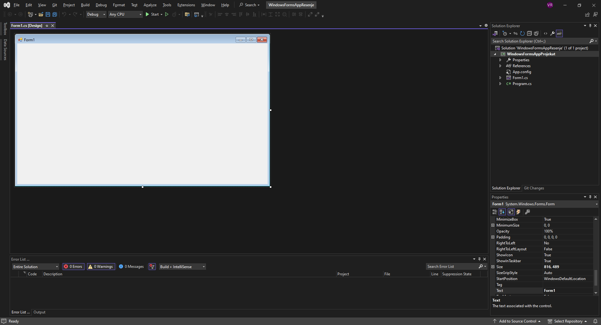
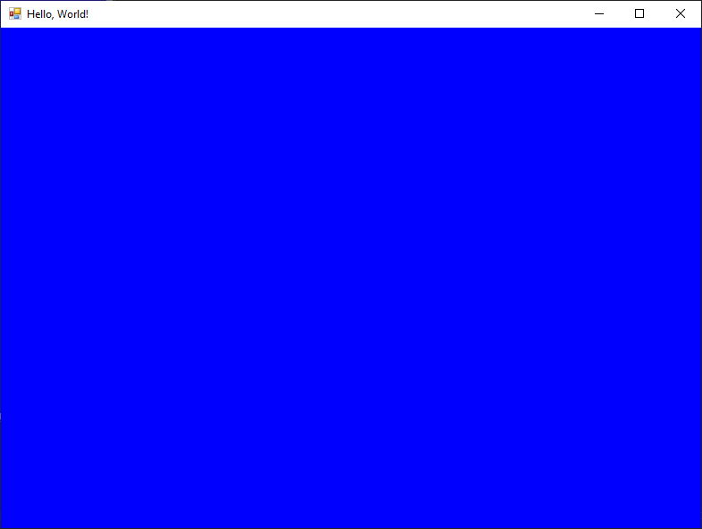

# Форма

Форма представља прозор у GUI апликацији. Када креираш нови *Windows Forms App*
пројекат, аутоматски се креира и једна форма која се зове `Form1`.



Класа `Form` припада именском простору `System.Windows.Forms` односно склопу
`System.Windows.Forms.dll`. Детаљан опис својстава, догађаја и метода класе
`Form` налази се у званичној
[документацији](https://learn.microsoft.com/en-us/dotnet/api/system.windows.forms.form?view=netframework-4.8).
Има их много и нема потребе наводити их све на овом месту.

Величину, боју и остала својства и функције форме можеш подесити помоћу
својстава дефинисаних у класи `Form`. Својства форме `Form1` можеш мењати у
`Properties` прозору када је `Form1` у фокусу, или у самом коду.

На пример, нека је задатак да се форма `Form1` зове `frmGlavna`, да у њеној
насловној линији пише `Hello, World!`, да се иницијално прикаже на центру
екрана, да је димензија 800x600 пиксела и да је плаве боје. Ако знаш енглески
језик, лако ћеш пронаћи ова својства у `Properties` прозору. Кликни било где
на форму, како би она била у фокусу, па промени следећа својства:

* име форме, својство `(Name)`, промени из `Form1` у `frmGlavna`,
* текст на насловној линији, својство `Text`, промени из `Form1` у
`Hello, World!`,
* стартна позиција, својство `StartPosition`, промени `WindowsDefaultLocation`
на `CenterScreen`,
* димензије форме, својство `Size` па `Width` и `Height`, промени `816` и `489`
на `800` и `600` и на крају
* боју форме, својство `BackColor`, промени из `Control` у `Blue`.

```{image} images/form-properties.png
:scale: 100
:align: center
```


Својства форме у `Properties` прозору организована су по категоријама:
*Accessibility*, *Apperance*, *Behavior*,... зато што је притиснута икона
`Categorized` на врху `Properties` прозора. Ако ти је лакше да својства тражиш
по абецедном распореду, кликни на икону `Alphabetical` која се налази поред
иконе `Categorized`. Корисно је и да знаш да се својства која си мењао
приказују задебљаним фонтом. Резултат покретања пројекта сада ће бити:



У уводној лекцији напоменуто је да су догађаји битни елементи приликом развоја
GUI апликација. Један од честих догађаја је *"на клик"*. На пример, нека
је задатак да се кликом миша на форму промени боја форме из плаве у црвену и
текст у насловној линији из `Hello, World!` у `Welcome!`. Кликни било где на
форму, како би она била у фокусу, па кликни на икону `🗲` (`Events`). Пронађи
догађај `Click` и кликни два пута брзо у поље поред. Креираће се метода
`frmGlavna_Click`. У телу методе неопходно је да унесеш кôд како би се
променила боја и насловна линија форме.

```cs
private void frmGlavna_Click(object sender, EventArgs e)
{
    this.BackColor = System.Drawing.Color.Red;
    this.Text = "Welcome!";
}
```

Нека је сада задатак да се дуплим кликом на форму изађе из апликације. Кликни
било где на форму, како би она била у фокусу, па кликни на икону `🗲`
(`Events`). Пронађи догађај `DoubleClick` и кликни два пута брзо у поље поред.
Креираће се метода `frmGlavna_DoubleClick`. У телу методе неопходно је да
унесеш кôд за излазак из апликације.

```cs
private void frmGlavna_DoubleClick(object sender, EventArgs e)
{
    Application.Exit();
}
```

У овом једноставном примеру мењао си нека својства форме и дефинисао неке
догађаје. Више о својствима и догађајима форме научићеш у наредним лекцијама.

Вероватно си користио апликације у оквиру којих постоји више форми и те форме
су биле различитих типова. У *Windows Forms App* пројектима подржан је рад са
више форми, али ће то бити једна од тема у IV разреду.
