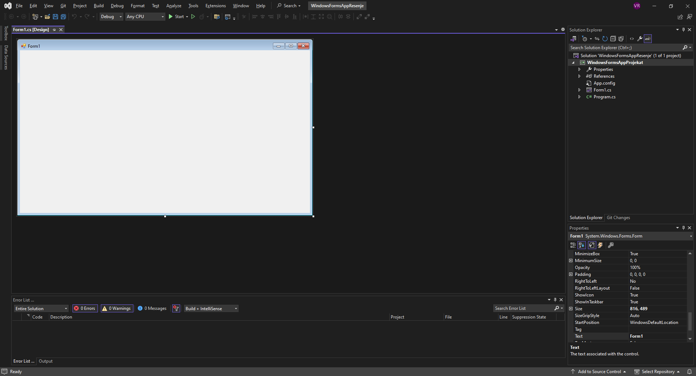

# Израда пројекта

Креирање *Windows Forms* пројекта прилично је једноставно и интуитивно. Када
покренеш развојно окружење Visual Studio, кликни на `Create a new project`:


Одабери `Windows Forms App (.NET Framework)` и кликни `Next`:


Одабери име пројектa, локацију, име решења и *.NET Framework* верзију, па кликни
`Create`:


У односу на окружење за развој конзолних апликација, окружење за развој GUI
апликација се мало разликује.



Уместо простора за унос програмског кода налази се празан прозор. На левој
страни налази се попуњена палета са алатима (*Toolbox*), а на десној, испод
*Solution Explorer*-a у *Properties* прозору сада се појавило мноштво опција:


*Toolbox* и *Properties* прозор користићеш у свим пројектима који следе, а
окружење у којем се види празан прозор уместо програмског кода зове се дизајнер
(*Designer*).

Све пречице на тастатури за покретање, дебаговање и грађење апликације су исте.
Притиском на тастере `CTRL` и `F5` покренућеш апликацију без дебаговања,
притиском на тастер `F5` покренућеш процес дебаговања и притиском на тастере
`CTRL`, `SHIFT` и `B` покренућеш грађење (*build*) апликације.

Ако покренеш апликацију без дебаговања, где ниси написао ни једну линију кода,
покренуће се празан прозор који у насловној линији има подразумевану икону, име
`Form1` и дугмад `Minimize`, `Maximize` и `Close`:


Где је нестао кôд?

Ако притиснеш тастер `F7` појавиће се кôд јавне парцијалне класе `Form1`
изведене из класе `Form`, која се налази у именском простору који носи име твог
пројекта, на пример:

```cs
using System;
using System.Collections.Generic;
using System.ComponentModel;
using System.Data;
using System.Drawing;
using System.Linq;
using System.Text;
using System.Threading.Tasks;
using System.Windows.Forms;

namespace WindowsFormsAppProjekat
{
    public partial class Form1 : Form
    {
        public Form1()
        {
            InitializeComponent();
        }
    }
}
```

Ако је класа `Form1` парцијална, где је онда други део те класе? У
*Solution Explorer*-у треба да рашириш ставку `Form1.cs`, да би се појавио
`Form1.Designer.cs` у којем се налази аутоматски генерисан кôд од стране
дизајнера, тј. други део парцијалне класе `Form1`, на пример:

```cs
namespace WindowsFormsAppProjekat
{
    partial class Form1
    {
        /// <summary>
        /// Required designer variable.
        /// </summary>
        private System.ComponentModel.IContainer components = null;

        /// <summary>
        /// Clean up any resources being used.
        /// </summary>
        /// <param name="disposing">true if managed resources should be disposed; otherwise, false.</param>
        protected override void Dispose(bool disposing)
        {
            if (disposing && (components != null))
            {
                components.Dispose();
            }
            base.Dispose(disposing);
        }

        #region Windows Form Designer generated code

        /// <summary>
        /// Required method for Designer support - do not modify
        /// the contents of this method with the code editor.
        /// </summary>
        private void InitializeComponent()
        {
            this.components = new System.ComponentModel.Container();
            this.AutoScaleMode = System.Windows.Forms.AutoScaleMode.Font;
            this.ClientSize = new System.Drawing.Size(800, 450);
            this.Text = "Form1";
        }

        #endregion
    }
}
```

Ти ћеш углавном писати кôд у јавној парцијалној класи `Form1.cs`, док ће
дизајнер сам попуњавати `Form1.Designer.cs`.

Главни програм налази се у `Program.cs` и изгледа, на пример, овако:

```cs
using System;
using System.Collections.Generic;
using System.Linq;
using System.Threading.Tasks;
using System.Windows.Forms;

namespace WindowsFormsAppProjekat
{
    internal static class Program
    {
        /// <summary>
        /// The main entry point for the application.
        /// </summary>
        [STAThread]
        static void Main()
        {
            Application.EnableVisualStyles();
            Application.SetCompatibleTextRenderingDefault(false);
            Application.Run(new Form1());
        }
    }
}
```

Ово је такође аутоматски генерисан кôд којег углавном нећеш имати потребе да
мењаш.

Када притиснеш тастере `SHIFT` и `F7`, вратићеш се у дизајнер. Дизајнер ће бити
почетно место израде твојих пројеката. Као што је у претходној лекцији
написано, обично ћеш се прво бавити дизајном графичког корисничког интерфејса
(дефинисањем својстава контрола), па након тога програмирањем функционалности
апликације (дефинисањем догађаја). Такође, све што си до сада научио о
програмском језику C# и објектно-оријентисаном програмирању моћи ћеш да примениш
и у *Windows Forms App* пројектима.
