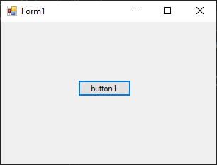
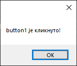
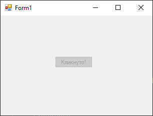

# Кастовање контрола

Често ће бити потребно да сазнаш која је компонента у *Windows Forms App*
пројекту иницирала неки догађај, како би могао да радиш са својствима или
методама те компоненте.

На пример, нека је потребно да радиш са својствима и методама неког дугмета
на основу догађаја `Click`. Задатак је да својство `Text` промениш у
`Кликнуто!` и онемогућиш дугме, ако је корисник кликнуо на то дугме.
Креирај нови *Windows Forms App (.NET Framework)* пројекат и додај једно дугме
на форму.



Кликни на дугме, па у `Properties` прозору креирај догађај `Click`. Како
изгледају параметри догађаја `Click` за једно дугме?

```cs
private void button1_Click(object sender, EventArgs e)
{
    
}
```

Параметар `object sender` представља извор или иницијатор догађаја. То је
објекат који је покренуо догађај. Значи, ако се кликом на дугме `button1`
покрене догађај, онда ће `sender` бити инстанца дугмета `button1`.

`EventArgs e` параметар садржи податке који се односе на догађај. `EventArgs`
је основна класа која се користи за све догађаје, али често се користе и класе
наслеђене из класе `EventArgs` које садрже додатне информације специфичне за
одређени догађај. На пример, за догађај који се покреће при промени текста у
контроли `TextBox` можеш користити класу `TextChangedEventArgs` која наслеђује
`EventArgs` и садржи додатне информације о томе како се текст променио.

Како онда можеш да сазнаш да ли је неко дугме кликнуто и решиш задатак?

У следећем коду, када корисник кликне на дугме...

```cs
private void button1_Click(object sender, EventArgs e)
{
    Button kliknutoDugme = sender as Button;
    MessageBox.Show(kliknutoDugme.Text + " је кликнуто!");
}
```

...`sender` је објекат који је покренуо догађај (у овом случају дугме), a `e`
је објекат типа `EventArgs` који садржи информације о догађају, а у следећој
линији кода...

```cs
Button kliknutoDugme = sender as Button;
```

...извршена је операција кастовања објекта `sender` у тип `Button` помоћу
оператора `as`. Због тога ће у `MessageBox.Show()` методи, новокреирани објекат
`kliknutoDugme` типа `Button` имати исто својство `Text` као и оригинално дугме
`button1`:



Са кастовањем си се сусрео још у првом разреду, где си променљиве једног типа
експлицитно кастовао у други тип. У програмском језику C# кастовање објекта из
једног у други тип можеш да реализујеш на два начина:

* користећи оператор `as`, као у примеру изнад, где оператор `as` покушава да
изврши кастовање и враћа `null` ако кастовање није успешно, или
* експлицитно, као у програмском језику C, где се наводи жељени тип у заградама
испред објекта који се кастује, на пример:

```cs
Button kliknutoDugme = (Button)sender;
```

Зашто је боље користити оператор `as` од експлицитног кастовања? Ако користиш
оператор `as`, а `sender` није типа `Button`, `kliknutoDugme` ће бити `null` и
неће бити бачен изузетак. Ако извршиш експлицитно кастовање, а `sender` није
типа `Button`, биће бачен изузетак!

Ово можеш искористити да решиш дати задатак на следећи начин:

```cs
private void button1_Click(object sender, EventArgs e)
{
    Button kliknutoDugme = sender as Button;
    if (kliknutoDugme != null)
    {
        kliknutoDugme.Text = "Кликнуто!";
        kliknutoDugme.Enabled = false;
    }
}
```

Прво је извршено кастовање `sender` у тип `Button` помоћу оператора `as`. Ако
је кастовање успело, `kliknutoDugme` неће бити `null`, па можеш да користиш
својства и методе дугмета онако како је тражено у задатку - својство `Text`
промениш у `Кликнуто!` и онемогућиш дугме тако што ћеш својству `Enabled`
доделити вредност `false`. С друге стране, ако кастовање из неког разлога није
успело, `kliknutoDugme` ће бити `null` и неће се десити ништа - неће бити бачен
изузетак нити ће се извршити наредбе у оквиру условне наредбе `if`, јер израз
`kliknutoDugme != null` није тачан.


