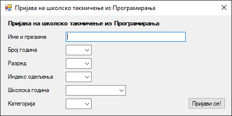
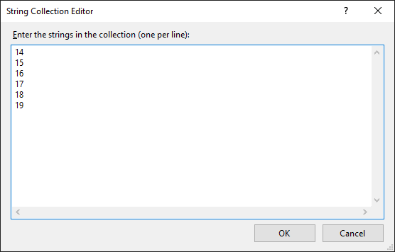
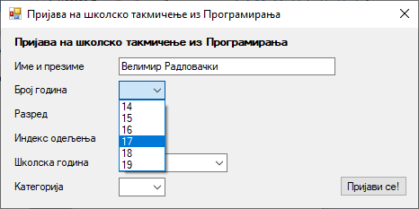
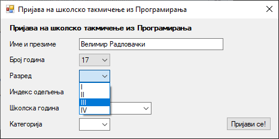
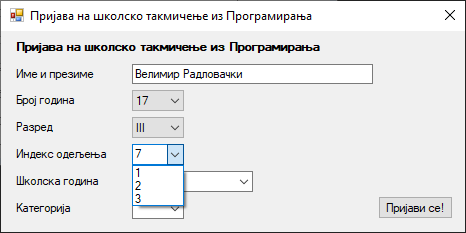
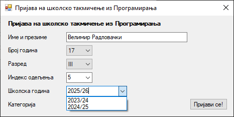
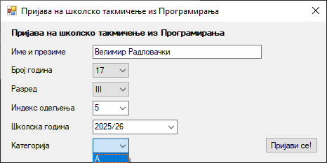
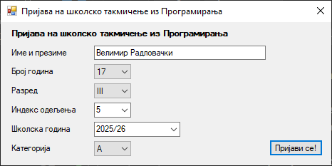
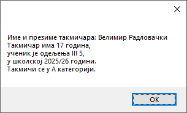
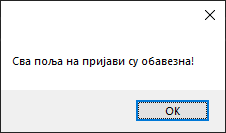

# Комбиновани оквир

Контрола **комбиновани оквир** (енгл. *ComboBox*), у литератури на српском
језику назива се и **комбинована листа** или **комбиновано поље** што одражава
функционалност ове контроле, која комбинује текстуална поља и падајућу листу.
Контрола `ComboBox` дефинисана је у класи `ComboBox` у именском простору
`System.Windows.Forms`, односно склопу `System.Windows.Forms.dll`. Класа
`ComboBox` наслеђује класу `ListControl` која наслеђује класу `Control`, па
због тога лабеле имају основна својства, догађаје и методе као и остале
контроле у *Windows Forms App* пројектима.

Детаљан опис својстава, догађаја и метода класе `ComboBox` налази се у
званичној [документацији](https://learn.microsoft.com/en-us/dotnet/api/system.windows.forms.combobox?view=netframework-4.8).
Има их много и нема потребе наводити их све на овом месту.

Ова контрола омогућује ти да приказујеш и одабираш ставке из падајуће листе.
У зависности од потребе, ставке можеш да унапред дефинишеш и/или уносиш.

Својства контроле `ComboBox` која ћеш често користи су:

* ако се комбиновани оквир попуњава колекцијом објеката`DisplаyMember` одређује
која својства објекта ће бити приказана кориснику, а `ValueMember` одређује
вредност која ће бити враћена када се одабере нека ставка,
* својство `Items` представља колекцију ставки које ће бити приказане у
контроли,
* својства `SelectedIndex` и `SelectedItem` омогућавају да се прикаже или
постави тренутно одабрана ставка у контроли и
* својство `DropDownStyle` којим се одређује понашање и изглед конртоле, а
обично се поставља на `DropDown` или `DropDownList`.

Ова и остала својства комбинованог оквира упознаћеш боље у IV разреду када у
њих комбиноване оквире будеш уписивао податке из базе података.

## Задатак

Нека је задатак да креираш једноставну GUI апликацију за пријаву ученика на
школско такмичење из програмирања. Такмичари треба да доставе следеће податке:

* име и презиме,
* број година (14, 15, 16, 17, 18 или 19)
* разред (I, II, III или IV),
* индекс одељења (1, 2, 3, 4, 5...),
* текућу школску годину (2023/24, 2024/25...) и
* категорију у којој се пријављују (A или B).

Након уноса података, када кликну дугме "Пријави се!", треба да се прикаже
порука са достављеним подацима такмичара и треба да се ресетују сва поља за
унос теста или одабир ставки. Логично је да прво поље `Име и презиме` буде
оквир за текст. Остала поља могу се имплементирати различитим контролама. Вежбе
ради, сва остала поља имплементираћеш комбиновим оквирима.

Креирај нови *Windows Forms App (.NET Framework)* пројекат са формом димензија
400×240, постави контроле као на слици...



...и дај им нека смислена имена.

Притисни `F7` и у јавној парцијалној класи `Form1 : Form` дефиниши поља:

```cs
private string imePrezime = string.Empty;
private string brojGodina = string.Empty;
private string razred = string.Empty;
private string indeksOdeljenja = string.Empty;
private string skolskaGodina = string.Empty;
private string kategorija = string.Empty;
```

Кликни на дугме и дефиниши догађај клика на дугме `btnPrijava_Click`. У
претходним лекцијама научио си да користиш поље за текст, па додели вредност
поља за текст пољу `imePrezime`:

```cs
imePrezime = txtImePrezime.Text;
```

Број година такмичара дефинисан је текстом задатка и може бити 14, 15, 16, 17,
18 или 19. То значи да такмичару не треба дозволити да унесе други број осим
понуђеног. У `Properties` прозору, у својству `Items`, поред `[Collection]`,
кликни на дугме `...`. Унеси дозвољене вредности за број година, сваку у
посебној линији...



...и промени својство `DropDownStyle` из `DropDown` у `DropDownList`. Тако ћеш
омогућити само одабир ставки са листе, а онемогућити унос:



Одабрану вредност можеш доделити пољу `brojGodina` на следећи начин:

```cs
brojGodina = cmbBrojGodina.Text;
```

Исто понови за разред са вредностима I, II, III или IV...



...па одабрану вредност додели пољу `razred`:

```cs
razred = cmbRazred.Text;
```

Индекс одељења разликује се од школе до школе. У неким школама индекс одељења
приказује се цифрама (1, 2, 3...), а у неким словима (A, B, C...), стим да
различите школе имају различит број одељења. Зато, неке вредности индекса
одељења можеш "понудити" у комбинованом оквиру, али треба да омогућиш и унос
других вредности које нису понуђене. На пример, понуди вредности `1`,`2` и `3`
али остави подразумева вредност својства `DropDownStyle` на `DropDown` како би
омогућио и унос других вредности...



...па одабрану или унешену вредност додели пољу `odeljenje`:

```cs
indeksOdeljenja = cmbIndeksOdeljenja.Text;
```

Исто понови за школску годину са вредностима 2023/24 и 2024/25...



...па одабрану или унешену вредност додели пољу `skolskaGodina`:

```cs
skolskaGodina = cmbSkolskaGodina.Text;
```

Такмичење из програмирања постоји само у A и B категорији, па за комбиновани
оквир за одабир категорије постави својство `DropDownStyle` на `DropDownList`:



...па одабрану вредност додели пољу `kategorija`:

```cs
kategorija = cmbKategorija.Text;
```

Када креираш обрасце које треба да попуне корисници, буди сигуран да ће неки
корисник кликнути на дугме за предају обрасца пре него што је попунио сва поља.
Да би спречио такмичара да преда пријаву са непопуњеним пољима, прво провери да
ли су сва поља попуњена, па ако нису, врати га назад на попуњавање поља. С
друге стране, ако корисник јесте попунио сва поља, прикажи му одговарајућу
поруку и ресетуј сва поља и контроле:

```cs
if (imePrezime == string.Empty || brojGodina == string.Empty || razred == string.Empty ||
    indeksOdeljenja == string.Empty || skolskaGodina == string.Empty || kategorija == string.Empty)
{
    MessageBox.Show("Сва поља на пријави су обавезна!");
}
else
{
    MessageBox.Show("Име и презиме такмичара: " + imePrezime +
        "\r\nТакмичар има " + brojGodina + " година," +
        "\r\nученик је одељења " + razred + " " + indeksOdeljenja + "," +
        "\r\nу школској " + skolskaGodina + " години." +
        "\r\nТакмичи се у " + kategorija + " категорији.");
    resetujSvaPolja();
}
```

Методу за ресет поља и контрола можеш да напишеш овако...

```cs
private void resetujSvaPolja()
{
    imePrezime = string.Empty;
    brojGodina = string.Empty;
    razred = string.Empty;
    indeksOdeljenja = string.Empty;
    skolskaGodina = string.Empty;
    kategorija = string.Empty;
    
    txtImePrezime.Text = string.Empty;
    cmbBrojGodina.SelectedIndex = -1;
    cmbRazred.SelectedIndex = -1;
    cmbIndeksOdeljenja.SelectedIndex = -1;
    cmbSkolskaGodina.SelectedIndex = -1;
    cmbKategorija.SelectedIndex = -1;
}
```

Комбиноване оквире можеш ресетовати и постављањем својства `Text` на `string.Empty`.

Ако је корисник попунио сва поља...



...кликом на дугме приказаће се следећа порука...



...а ако није:



Наравно, у некој конкретној апликацији ове податке бележио би у фајл или базу
података.
