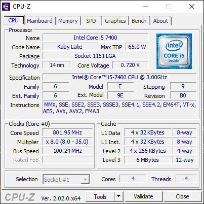
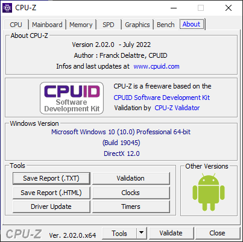
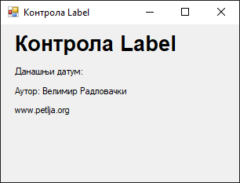
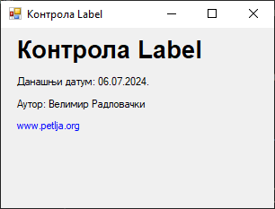
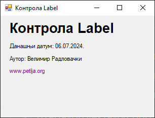
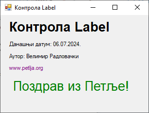

# Лабела

Контрола **лабела** (енгл. *label*), у литератури на српском језику често
названа и **ознака**, дефинисана је у класи `Label` у именском простору
`System.Windows.Forms`, односно склопу `System.Windows.Forms.dll`. Класа
`Label` наслеђује класу `Control`, па због тога лабеле имају основна својства,
догађаје и методе као и остале контроле у *Windows Forms App* пројектима.

Детаљан опис својстава, догађаја и метода класе `Label` налазе се у званичној
[документацији](https://learn.microsoft.com/en-us/dotnet/api/system.windows.forms.label?view=netframework-4.8).
Има их много и нема потребе наводити их све на овом месту. Својствима лабеле
можеш детаљно дефинисати изглед лабеле и положај лабеле на форми. Лабеле
учествују у редоследу картица (енгл. *TAB order*) у којем добијају свој индекс
(`TabIndex`), али не примају фокус (`TabStop`).

Обично ћеш користити лабеле за приказ текста кориснику или за приказ описног
текста за неку другу контролу. На пример, у следећој апликацији...



...контролама лабела описани су садржаји оквира за текст (*Name*, *Code Name*,
*Max TDP*, *Package*...), садржај комбинованог оквира за текст (*Selection*) и
у дну апликације у лабели приказан је текст кориснику којим се корисник
обавештава о тренутној верзији апликације (*Ver. 2.02.0.x64*).

У истој апликацији, на овој картици...



...у лабелама су приказане информације о верзији и аутору апликације, потом су
лабелама реализовани хиперлинкови (`www.cpuid.com`, `CPUID Software...`,
`CPU-Z Validator`) и на крају су у лабелама приказане информације о оперативном
систему корисника.

Контролу лабела можеш поставити на форму на два начина:

* помоћу дизајнера (енгл. *Design-Time*) или
* мануелно програмским кодом у току извршавања апликације (енгл. *Run-Time*).

Како је ово прва контрола о којој учиш, креираћеш једноставну GUI апликацију
у којој ћеш користити само лабела контроле и једну форму. Нека је задатак да
се креира Windows Forms Apps (.NET Framework) пројекат са једном формом
димензија 320×240. На форму треба да поставиш:

* лабелу у којој ће бити исписан текст **Контрола Label** задебљаним (`Bold`)
фонтом `Arial`, величине `20`,
* лабелу у којој ће бити исписан текст **Данашњи датум: 01.09.2024**, где
уместо 01.09.2024. треба бити приказан данашњи датум,
* лабелу у којој ће бити исписан текст **Аутор: Име Презиме**, где Име Презиме
треба да замениш својим именом и презименом,
* лабелу у којој ће бити исписан текст **`www.petlja.org`** који се понаша као
хиперлинк - исписан је плавом бојом, ако се преко њега пређе мишем текст
постаје љубичаст и мења се показивач миша, а ако се на њега кликне, испод треба
да се појави пета лабела,
* на петој лабели биће исписан текст **Поздрав из Петље!** задебљаним
(`Bold`) фонтом `Arial`, величине `20`, зелене боје.

Обично се подразумевана имена лабела мењају из `label1`, `label2`, `label3`...
у нека смислена имена, на пример, `lblNaslov`, `lblDatum`, `lblAutor`...
Променом подразумеваних имена контрола сваком ће бити јасно о којој је лабели
реч. Ако остану подразумевана имена, након одређеног времена ни ти се нећеш
сећати које име припада којој контроли, нарочито ако ниси постављао контроле
редом.

Постави све лабеле осим последње, онако како је тражено у задатку. Својства
прве лабеле можеш најбрже променити у `Properties` прозору:

* својство `Text` постави на `Контрола Label`,
* својство `Font`, `Name` постави на `Arial`,
* својство `Font`, `Size` постави на `20` и
* својство `Font`, `Bold` постави на `True`.

Форма са постављене четири лабеле сада треба да изгледа овако:



Текст у другој лабели требаш да прошириш са стварним данашњим датумом. Како
датум треба бити видљив одмах приликом приказа форме, као и боја четврте
лабеле, кликни на форму па дефиниши догађај `Load` на следећи начин:

```cs
private void Form1_Load(object sender, EventArgs e)
{
    lblDatum.Text = "Данашњи датум: " + DateTime.Now.ToString("dd.MM.yyyy.");
    lblSajt.ForeColor = Color.Blue;
}
```

Сада је приликом приказа форме приказан данашњи датум, а боја текста четврте
лабеле је плава:



Следећи задатак је да промениш боју текста четврте лабеле и показивач миша када
се преко ње пређе мишем преко. Значи, када се показивач миша нађе изнад четврте
лабеле, боја четврте лабеле постаје љубичаста и показивач миша добија облик
руке (`Hand`), односно, када се показивач миша склони са четврте лабеле, њена
боја враћа се на плаву, а показивач миша поново добија подразумевани облик. Да
би имплементирао ову функционалност потребно је да дефинишеш догађај преласка
миша преко четврте лабеле...

```cs
private void lblSajt_MouseHover(object sender, EventArgs e)
{
    lblSajt.ForeColor = Color.Purple;
    lblSajt.Cursor = Cursors.Hand;
}
```

...и догађај склањања показивача миша са четврте лабеле:

```cs
private void lblSajt_MouseLeave(object sender, EventArgs e)
{
    lblSajt.ForeColor = Color.Blue;
    lblSajt.Cursor = Cursors.Default;
}
```

Сада, када пређеш мишем преко четврте лабела, текст лабеле постаће љубичаст, а
показивач миша претвориће се из подразумеване стрелице у руку, односно, када
склониш миша са четвте лабеле, текст ће опет постати плав и показивач миша
вратиће се на подразумевани:



Последњи задатак је да дефинишеш догађај клика миша на четврту лабелу. Када се
кликне мишем на четврту лабелу, потребно је да се појави пета лабела са текстом
`Поздрав из Петље!` која има својства дефинисана у задатку. Постоји више начина
да решиш овај задатак. Најједноставнији начин је да креираш и пету лабелу у
дизајнеру са свим траженим својствима и да је сакријеш (својство `Visible`
поставиш на `False`), а када се кликне на четврту лабелу да је прикажеш
(својство `Visible` поставиш на `True`).

Вежбе ради, овај задатак решићеш на мало тежи начин, креирањем пете лабеле из
програмског кода (у току извршавања програма). Значи, кликом на четврту лабелу,
потребно је да креираш нови објекат типа `Label`, да дефинишеш својства тог
објекта и да га поставиш на форму, на пример овако:

```cs
private void lblSajt_Click(object sender, EventArgs e)
{
    Label lblPozdrav = new Label();
    lblPozdrav.Text = "Поздрав из Петље!";
    lblPozdrav.Location = new Point(20, 130);
    lblPozdrav.AutoSize = true;
    lblPozdrav.Font = new Font("Arial", 20);
    lblPozdrav.ForeColor = Color.Green;
    this.Controls.Add(lblPozdrav);
}
```

Прво је креиран објекат `lblPozdrav` типа контроле `Label`, потом је дефинисан
текст контроле, па локација контроле у односу на горњи леви угао форме, па је
омогућена аутоматска величина контроле, дефинисан фонт и боја текста лабеле и
на крају, контрола је додата на форму.

Сада, када кликнеш на четврту лабелу, приказаће се пета лабела, онако како је
тражено у тексту задатка:


