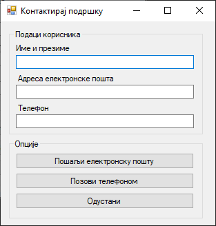
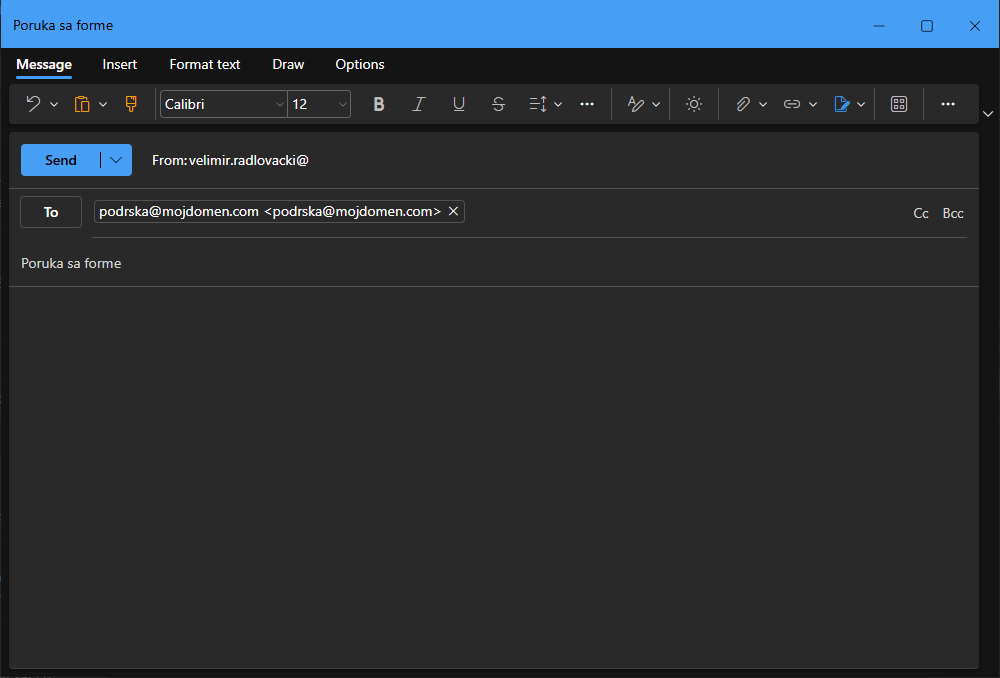
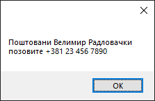

# Оквир за групу

Контрола **оквир за групу** (енгл. *GroupBox*) дефинисана је у класи `GroupBox`
у именском простору `System.Windows.Forms`, односно склопу
`System.Windows.Forms.dll`. Класа `GroupBox` наслеђује класу `Control`, па због
тога контрола оквир за групу има основна својства, догађаје и методе као и
остале контроле у *Windows Forms App (.NET Framework)* пројектима.

Детаљан опис својстава, догађаја и метода класе `GroupBox` налази се у
званичној [документацији](https://learn.microsoft.com/en-us/dotnet/api/system.windows.forms.groupbox?view=netframework-4.8).
Има их много и нема потребе наводити их све на овом месту.

Као и панел, контрола `GroupBox` користи се за груписања других контрола, тј.
служи као контејнер за друге контроле које имају неку заједничку
функционалност. Догађаји (као што су клик или промена вредности) који се
дешавају у контролама унутар оквира за групу, могу се обрадити на исти начин
као да су самосталне.

Оквир за групу садржи оквир око груписаних контрола са опционим насловом. У
односу на панел, који нема наслов, оквир за групу нема вертикалне и/или
хоризонталне скрол траке.

## Задатак

Нека је задатак да дизајнираш образац за корисничку подршку. Корисник на
обрасцу треба да унесе своје име, адресу електронске поште и број телефона,
па потом одабере опцију да ли жели да позове корисничку подршку телефоном,
пошаље поруку електронском поштом или одустане.

Образац би могао да изгледа овако (komentar: tekst na dugmetu glasi Пошаљи електронску пошту, mozda je bolje Пошаљи поруку електронском поштом):




Додај први оквир за групу на форму. Промени својство `Text` у "Подаци
корисника", како би променио наслов оквира за групу, па поређај потребне
контроле. Исто уради и са другим оквиром.

Кликом на прво дугме може се позвати `mailto` линк, на пример овако...

```cs
private void btnEmail_Click(object sender, EventArgs e)
{
    Process.Start("mailto:podrska@mojdomen.com?subject=Poruka%20sa%20forme");
}
```

...а то ће у клијенту за електронску пошту формирати нову поруку, где је поље
`To:` попуњено са `podrska@mojdomen.com` и поље `Subject` са `Poruka sa forme`:



Кликом на друго дугме, корисник се поруком може обавестити о броју телефона
подршке:

```cs
private void btnTelefon_Click(object sender, EventArgs e)
{
    string korisnik = null;
    if (txtIme.Text != string.Empty)
    {
        korisnik = txtIme.Text;
    }
    else
    {
        korisnik = "Корисник апликације";
    }
    MessageBox.Show("Поштовани " + korisnik + "\r\nпозовите +381 23 456 7890");
}
```



Кликом на треће дугме затвара се форма, а у овом случају и апликација:

```cs
private void btnOdustani_Click(object sender, EventArgs e)
{
    this.Close();
}
```

Ово је био прилично једноставан пример груписања контрола по функцији - у првој
групи нашли су се подаци корисника, а у другој акције корисника. Оваква
организација контрола визуелно помаже кориснику да се лакше снађе и лакше попуни
образац.
