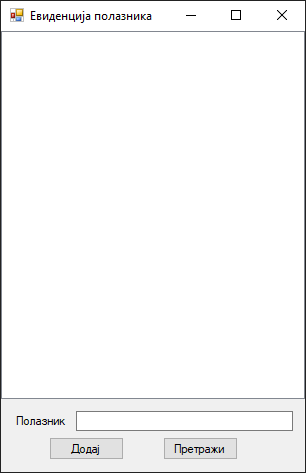
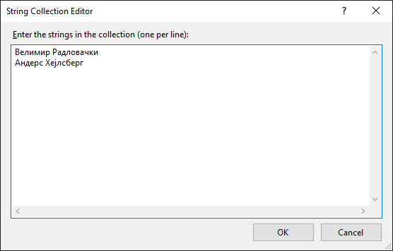
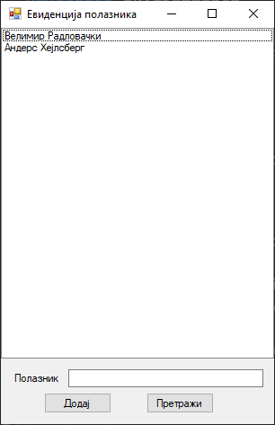
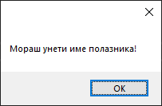
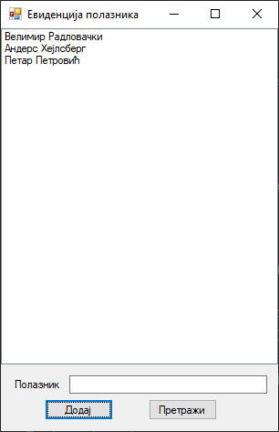
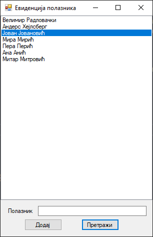
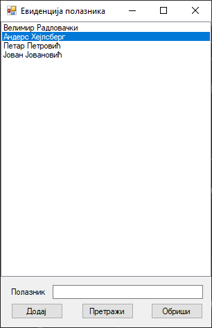
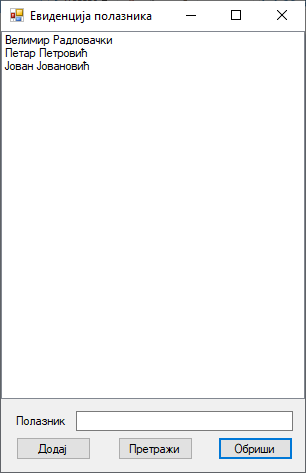
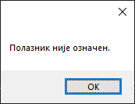

# Оквир за листу

Контрола **оквир за листу** (енгл. *ListBox*) дефинисана је у класи `ListBox` у
именском простору `System.Windows.Forms`, односно склопу
`System.Windows.Forms.dll`. Класа `ListBox` наслеђује класу `ListControl` која
наслеђује класу `Control`, па због тога оквири за листу имају основна својства,
догађаје и методе као и остале контроле у *Windows Forms App* пројектима.

Детаљан опис својстава, догађаја и метода класе `ListBox` налази се у
званичној [документацији](https://learn.microsoft.com/en-us/dotnet/api/system.windows.forms.listbox?view=netframework-4.8).
Има их много и нема потребе наводити их све на овом месту.

Оквир за листу користи се за приказивање листе ставки, где корисник може да
изабере једну или више ставки са листе. Оквир за листу може се користити за
приказ више колона, а колоне могу садржати и слике или друге контроле.

Својства, догађаје и методе контроле оквир за листу која ћеш често користи
су:

* својство `Items` које представља колекцију ставки које ће бити приказане у
контроли,
* својства `SelectedIndex` и `SelectedItem` која омогућавају да се прикаже или
постави тренутно одабрана ставка у контроли и
* својство `SelectedItems` које представља колекцију свих тренутно изабраних
ставки.

Догађај `SelectedIndexChanged` који се покреће када се промени
означена ставка и методе:

* `Add()` за додавање нове ставке у листу,
* `Remove()`, `RemoveAt()` и `Clear()` за уклањање ставки са листе и
* `FindString()` за проналажење ставке на листи.

## Задатак

Нека је задатак да креираш једноставну GUI апликацију за креирање листе
полазника радионице програмирања. Иницијално, на листи треба да се налазе само
имена наставника. Користећи оквир за текст и дугмад треба да омогућиш додавање
нових полазника на листу и претрагу полазника на листи.

Креирај нови *Windows Forms App (.NET Framework)* пројекат са формом димензија
400×240, постави контроле као на слици...



...и дај им нека смислена имена.

## Додавање ставки на листу

Да би додао ставку у току дизајна програма, у `Properties` прозору, у својству
`Items`, поред `[Collection]`, кликни на дугме `...` и унеси имена наставника,
свако у посебној линији:



Имена ће се одмах појавити на листи.



Додавање нових ставки на листу у току извршавања програма прилично је
једноставно. Кликом на дугме `btnDodaj` потребно је име унето из оквира за
текст додати на листу методом `Add()`:

```cs
private void btnDodaj_Click(object sender, EventArgs e)
{
    string polaznik = txtPolaznik.Text;
    if (string.IsNullOrEmpty(polaznik) )
    {
        MessageBox.Show("Мораш унети име полазника!");
    }
    else
    {
        lsbPolaznici.Items.Add(polaznik);
        txtPolaznik.Text = string.Empty;
    }
}
```

Ако je корисник кликнуо `btnDodaj`, а није унео име полазника, добиће поруку...



...а ако јесте, име ће бити додато на листу:



## Претрага листе

Једна од основних функција приликом рада са било каквим листама је свакако
претрага листе. У оквиру за листу можеш да користиш методу `FindString()`
како би пронашао стринг или подстринг на листи и означио резултат:

```cs
private void btnPretrazi_Click(object sender, EventArgs e)
{
    string polaznik = txtPolaznik.Text;
    if (string.IsNullOrEmpty(polaznik))
    {
        MessageBox.Show("Мораш унети име полазника!");
    }
    else
    {
        lsbPolaznici.ClearSelected();
        int indeks = lsbPolaznici.FindString(polaznik);
        if (indeks < 0)
        {
            MessageBox.Show("Полазник није пронађен.");
        }
        else
        {
            lsbPolaznici.SelectedIndex = indeks;
        }
        txtPolaznik.Text = string.Empty;
    }
}
```

У догађају `btnPretrazi_Click` прво се проверава да ли је корисник унео стринг
за претрагу. Ако није, добија поруку о томе, а ако јесте тражи се име полазника
које одговара задатом стрингу. Ако не постоји полазник на листи који одговара
задатом стрингу, вратиће се `-1`, а ако постоји, вратиће се његов индекс и
означити полазник на листи. На пример, ако се унесе стринг `Јован`:



Оваква имплементација метода `FindString()` није савршена. Ако се у примеру
изнад унесе стринг `Ми`, вратиће се само један индекс, односно индекс првог
имена на листи које почиње са `Ми` (индекс `3` - обележиће се `Мира Мирић`),
иако се на листи налази више имена које почињу са `Ми` (нпр. индекс `6` -
`Митар Митровић`).

## Брисање ставки са листе

Задатак би свакако требало проширити са још једним захтевом. На форми додај још
једно дугме са текстом "Обриши". Када се означи одређени полазник на листи и
кликне дугме за брисање, означеног полазника треба уклонити са листе. Постоји
више начина за уклањање ставки са листе: методом `Remove()`, методом
`RemoveAt()` или методом `Clear()`, ако желиш да уклониш све ставке са листе.

Додај дугме `btnObrisi` и дефиниши догађај клика на дугме. Најједноставнији
начин за уклањање ставки са листе у овом случају је методом `RemoveAt()`:

```cs
private void btnObrisi_Click(object sender, EventArgs e)
{
    if (lsbPolaznici.SelectedIndex > -1)
    {
        lsbPolaznici.Items.RemoveAt(lsbPolaznici.SelectedIndex);
    }
    else
    {
        MessageBox.Show("Полазник није означен.");
    }
}
```

Ако је корисник означио полазника и кликнуо на дугме `btnObrisi`...



...обрисаће се означени полазник на основу његовог индекса:



Ако корисник није означио полазника а кликнуо је на дугме `btnObrisi`, добиће
поруку о томе:



Слично, полазника можеш обрисати методом `Remove()` на основу његовог имена (komentar: da li se brise stavka koja je identicna datom stringu ili ona u kojoj se javlja string mozda kao podstring?):

```cs
private void btnObrisi_Click(object sender, EventArgs e)
{
    if (lsbPolaznici.SelectedIndex > -1)
    {
        string ime = lsbPolaznici.Items[lsbPolaznici.SelectedIndex].ToString();
        lsbPolaznici.Items.Remove(ime);
    }
    else
    {
        MessageBox.Show("Полазник није означен.");
    }
}
```

У некој конкретној апликацији користио би својство `DataSource` за повезивање
неке колекције података са оквиром за листу. Повезивање података са контролама
учићеш у четвртом разреду, када будеш научио више о генеричким класама и
листама.
