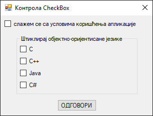
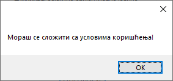

# Оквир за потврду

Контрола **оквир за потврду** (енгл. *CheckBox*) дефинисана је у класи
`CheckBox` у именском простору `System.Windows.Forms`, односно склопу
`System.Windows.Forms.dll`. Класа `CheckBox` наслеђује класу `ButtonBase`, која
наслеђује класу `Control`, па због тога оквир за потврду има основна својства,
догађаје и методе као и остале контроле у *Windows Forms App (.NET Framework)*
пројектима.

Детаљан опис својстава, догађаја и метода класе `CheckBox` налази се у
званичној [документацији](https://learn.microsoft.com/en-us/dotnet/api/system.windows.forms.textbox?view=netframework-4.8).
Има их много и нема потребе наводити их све на овом месту.

Контрола оквир за потврду означава да ли је одређени услов "укључен" или
"искључен". Обично се користи да представи кориснику избор типа Да/Не или
Тачно/Нетачно. На пример, "Да ли се слажеш са условима коришћења...", где
корисник треба да штиклира оквир за потврду како би наставио даље. Ако се ова
контрола користи у групама у неком контејнеру, онда се може имплементирати
вишеструки избор, где корисник изабира једну или више понуђених опција.

Контрола поља за потврду је слична контроли радио дугме по томе што се користи
за означавање избора који је направио корисник. Разликује се по томе што се
код радио дугмади може изабрати само по једно радио дугме у групи, док се код
поља за потврду може изабрати било који број поља за потврду у групи.

Ова контрола има два важна својства, `Checked` и `CheckState`. Својство
`Checked` враћа тачно или нетачно. Својство `CheckState` враћа или `Checked`
или `Unchecked` или, ако је својство `ThreeState` постављено на `True`, може да
врати и `Indeterminate`, где се оквир приказује са затамњеним изгледом који
указује да опција није доступна.

Нека је задатак да креираш једноставну GUI апликацију за демонстрацију рада са
контролом `CheckBox`. При врху форме треба да се налази оквир за потврду са
текстом: "слажем се са условима коришћења апликације". Испод, треба да се
налази оквир за групу са текстом "Штиклирај објектно-оријентисане језике" и
четири оквира за потврду са текстом:

* C
* C++
* Java
* C#

Испод оквира за групу треба да се налази дугме са текстом "ОДГОВОРИ". Кликом
на дугме, ако корисник није штиклирао први оквир за потврду, онда треба да
добије одговарајућу поруку о томе, а ако јесте, онда треба да се провери да ли
су штиклирани тачни одговори.

Креирај нови *Windows Forms App (.NET Framework)* пројекат са формом димензија
320×240, постави контроле као на слици...



...и дај им нека смислена имена.

Дефиниши догађај `Click` за дугме на следећи начин:

```cs
private void btnOdgovor_Click(object sender, EventArgs e)
{
    if (chkUslovi.Checked)
    {
        // ... провера тачних одговора
    }
    else
    {
        MessageBox.Show("Мораш се сложити са условима коришћења!");
    }
}
```

На овај начин си имплементирао први захтев, да корисник не може да одговара на
питања, док се прво не сложи са условима коришћења апликације, о чему добија
одговарајућу поруку:



Како се проверава да ли је корисник штиклирао све тачне одговоре може да зависи
од постављених правила. На пример, на твом твом матурском испиту, на тесту за
проверу стручно-теоријских знања важило би правило:

* за три тачна и ни један нетачан одговор добио би маскималних 3 бода,
* за два тачна и ни један нетачан одговор добио би 2 бода,
* за један тачан и ни један нетачан одговор добио би 1 бод и
* за све остало добио би 0 бодова.

Ово правило могао би да имплементираш овако:

```cs
private void btnOdgovor_Click(object sender, EventArgs e)
{
    if (chkUslovi.Checked)
    {
        int bodovi = 0;
        if (!chkOdogovor1.Checked)
        {
            if (chkOdogovor2.Checked) bodovi++;
            if (chkOdogovor3.Checked) bodovi++;
            if (chkOdogovor4.Checked) bodovi++;
        }
        MessageBox.Show("Добио си " + bodovi + " од могућа 3 бода!");
    }
    else
    {
        MessageBox.Show("Мораш се сложити са условима коришћења!");
    }
}
```

У некој конкретној апликацији за тестове знања, питање, одговори у текстовима
оквира за потврду и тачни одговори приказани као `True`/`False` стања оквира за
потврду учитавали би се из фајла или базе података и динамички смењивали једно
за другим.

Понекад ће бити потребно да апликација реагује на штиклирање оквира за потврду.
На пример, ако се задатак прошири захтевом да се прикаже одговарајућа порука у
тренутку када корисник штиклира да се слаже са условима коришћења, тај захтев
можеш имплементирати дефинисањем догађаја `Click` на оквир за потврду:

```cs
private void chkUslovi_Click(object sender, EventArgs e)
{
    MessageBox.Show("Хвала што си се сложио са условима коришћења!");
}
```
