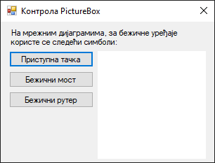
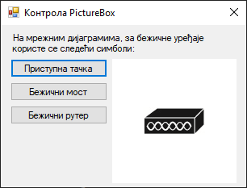
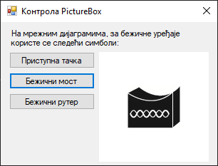
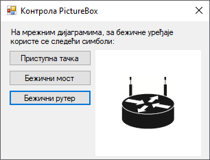

# Оквир за слику

Контрола **оквир за слику** (енгл. *PictureBox*) дефинисана је у класи
`PictureBox` у именском простору `System.Windows.Forms`, односно склопу
`System.Windows.Forms.dll`. Класа `PictureBox` наслеђује класу `Control`, па
због тога оквир за слику има основна својства, догађаје и методе као и остале
контроле у *Windows Forms App (.NET Framework)* пројектима.

Детаљан опис својстава, догађаја и метода класе `PictureBox` налази се у
званичној [документацији](https://learn.microsoft.com/en-us/dotnet/api/system.windows.forms.picturebox?view=netframework-4.8).
Има их много и нема потребе наводити их све на овом месту.

Контрола оквир за слику користи се за учитавање, приказивање и манипулацију
слика. Слику можеш учитати из фајла, ресурса или са *URL*-а користећи својство
`Image`. Помоћу својства `SizeMode` можеш подесити начин на који се слика
приказује у оквиру за слику, постављајући следеће вредности:

* `Normal`: Подразумевана вредност, слика се приказује у оригиналној величини.
* `StretchImage`: Слика се "развлачи" да попуни оквир за слику.
* `AutoSize`: Оквир за слику се аутоматски прилагођава величини слике.
* `CenterImage`: Слика се центрира у оквиру за слику.
* `Zoom`: Слика се пропорционално "развлачи" тако да стане у оквир за слику без
губитка пропорција.

Оквир за слике може да учита слику формата битмапе (BMP), иконе (ICO),
*Windows Metafile* (WMF), JPEG, GIF или PNG. Ако је неопходно да слика буде
транспарентна, оквир за слику подржава транспарентност у следећим графичким
форматима:

* 32-bit PNG,
* 8-bit PNG,
* 32-bit BMP,
* 32-bit TIFF или
* GIF.

Ако желиш да учиташ слику великих димензија, води рачуна о меморијским
ресурсима. Можеш да користиш методу `Dispose()` за ослобађање меморије након
што слика више није потребна. Ако учитаваш слику са интернета, корисно је да
користиш асинхроне методе попут `LoadAsync()` како би избегао да програм
постане неактиван док се чека да се слика учита.

Нека је задатак да креираш једноставну GUI апликацију за демонстрацију рада са
контролом `PictureBox`. При врху форме треба да се налази лабела са текстом:
"На мрежним дијаграмима, за бежичне уређаје користе се следећи симболи:". Испод
лабеле треба да поставиш три дугмета са текстом...

* Приступна тачка
* Бежични мост
* Бежични рутер

...и оквир за слику. Иницијално, оквир за слику треба да буде празан и треба да
има белу позадину. Када корисник кликне на неко од понуђених дугмади, у средини
оквира за слику треба да се прикаже једна од три понуђене слике:


Слике, преузете са странице [Network Topology Icons](https://www.cisco.com/c/en/us/about/brand-center/network-topology-icons.html),
су различитих димензија.

Креирај нови *Windows Forms App (.NET Framework)* пројекат са формом димензија
320×240, постави контроле као на слици...



...и дај им нека смислена имена. Својство `BackColor` треба да буде промењено
на `White`, како би позадина оквира била бела, а својство `SizeMode` на
`CenterImage`, како би се слике приказивале у средини оквира за слику.

Под претпоставком да си ископирао слике у исти директоријум у којем се налази и
изврши фајл, дефиниши догађај `Click` за прво дугме:

```cs
private void btnPristupna_Click(object sender, EventArgs e)
{
    Bitmap pristupnaTacka = new Bitmap("waccesspoint.jpg");
    pcbUredjaj.Image = pristupnaTacka;
}
```

Сада, кликом на прво дугме креира се објекат `pristupnaTacka` типа `Bitmap`, па
се исти додељује својству `Image`, оквира за слику `pcbUredjaj`:



Исто можеш урадити и за друго и треће дугме, па ако корисник кликне на друго
дугме, својству `Image`, оквира за слику `pcbUredjaj` биће додељена друга
слика...



...односно, ако кликне на треће дугме, својству `Image`, оквира за слику
`pcbUredjaj` биће додељена трећа слика:



**Шта није у реду са овим решењем?** Ако корисник кликне узастопно десет пута
на прво дугме, десет пута ће креирати нови објекат у меморији. Ово може да буде
нарочито опасно када су слике великих димензија. Решење проблема је једноставно
коришћењем методе `Dispose()`:

```cs
private void btnPristupna_Click(object sender, EventArgs e)
{
    if (pcbUredjaj.Image != null)
    {
        pcbUredjaj.Image.Dispose();
        pcbUredjaj.Image = null;
    }
    Bitmap pristupnaTacka = new Bitmap("waccesspoint.jpg");
    pcbUredjaj.Image = pristupnaTacka;
}
```

Прво се проверава да ли већ постоји слика у оквиру за слику. Ако постоји, она
се ослобађа позивањем `Dispose()` методе. На овај начин, корисник може да
кликне на било које дугме колико год пута жели. Сваким кликом, ако већ постоји
објекат додељен својству `Image`, тај објекат ће бити уништен. Након такве
провере може се креирати нови објекат и доделити својству `Image`.

Још боље решење је да се слике дефинишу као поља у класи `Form1`. Ово решење
омогућава учитавање слика једном и коришћење истих инстанци слика касније, без
потребе за сталним учитавањем и ослобађањем ресурса. Цео програм могао би да
изгледа овако:

```cs
using System;
using System.Drawing;
using System.Windows.Forms;

namespace OkvirZaSliku
{
    public partial class Form1 : Form
    {
        private Bitmap pristupnaTacka = new Bitmap("waccesspoint.jpg");
        private Bitmap bezicniMost = new Bitmap("wbridge.jpg");
        private Bitmap bezicniRuter = new Bitmap("wrouter.jpg");

        public Form1()
        {
            InitializeComponent();
        }

        private void btnPristupna_Click(object sender, EventArgs e)
        {
            pcbUredjaj.Image = pristupnaTacka;
        }

        private void btnMost_Click(object sender, EventArgs e)
        {
            pcbUredjaj.Image = bezicniMost;
        }

        private void btnRuter_Click(object sender, EventArgs e)
        {
            pcbUredjaj.Image = bezicniRuter;
        }

        private void Form1_FormClosing(object sender, FormClosingEventArgs e)
        {
            pristupnaTacka.Dispose();
            bezicniMost.Dispose();
            bezicniRuter.Dispose();
        }
    }
}
```

Добра пракса је да ресурсе типа `Bitmap`, када више нису неопходни, експлицитно
ослободиш. Ако не ослободиш ресурсе, може доћи до тзв. цурења меморије. У
примеру изнад то је урађено у догађају `FormClosing`. Други начин да ослободиш
ове ресурсе је, да уместо дефинисања `FormClosing` догађаја, у другом делу
парцијалне класе `Form1`, у фајлу `Form1.Designer.cs`, пронађеш и модификујем
методу `Dispose()` на следећи начин:

```cs
/// <summary>
/// Clean up any resources being used.
/// </summary>
/// <param name="disposing">true if managed resources should be disposed; otherwise, false.</param>
protected override void Dispose(bool disposing)
{
    if (disposing)
    {
        pristupnaTacka?.Dispose();
        bezicniMost?.Dispose();
        bezicniRuter?.Dispose();

        if (components != null)
        {
            components.Dispose();
        }
    }
    base.Dispose(disposing);
}
```
