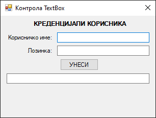
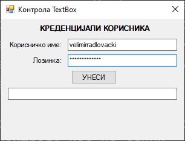
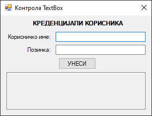
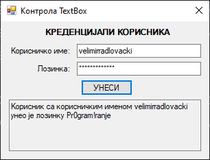
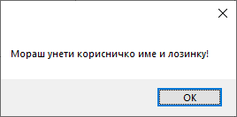
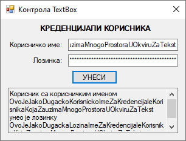

# Оквир за текст

Контрола **оквир за текст** (енгл. *TextBox*) дефинисана је у класи `TextBox` у
именском простору `System.Windows.Forms`, односно склопу
`System.Windows.Forms.dll`. Класа `TextBox` наслеђује класу `TextBoxBase`, која
наслеђује класу `Control`, па због тога оквир за текст има основна својства,
догађаје и методе као и остале контроле у *Windows Forms App (.NET Framework)*
пројектима.

Детаљан опис својстава, догађаја и метода класе `TextBox` налази се у
званичној [документацији](https://learn.microsoft.com/en-us/dotnet/api/system.windows.forms.textbox?view=netframework-4.8).
Има их много и нема потребе наводити их све на овом месту.

Оквир за текст се најчешће користи за добављање текстуалног уноса од корисника,
а ређе за приказ текста. Дозвољен је један формат текста за целу контролу, што
значи да не може део текста бити нпр. укошен, а други задебљан. Оквир за текст
може се користити за унос и приказ текста у више редова.

У једној линији текста у оквиру за текст могуће је унети или приказати до 2048
карактера, а ако је омогућено својство `Multiline` за унос и приказ текста у
више редова, могуће је унети или приказати до 32 KB текста.

Нека је задатак да креираш једноставну GUI апликацију за демонстрацију рада са
контролом `TextBox`. При врху форме треба да се налази лабела са текстом:
"КРЕДЕНЦИЈАЛИ КОРИСНИКА". Испод те лабеле треба да поставиш две лабеле са
текстом "Корисничко име:" и "Лозинка:" и два оквира за текст за унос
корисничког имена и лозинке. На форми треба да поставиш и дугме са текстом
"УНЕСИ". Ако је корисник унео податке у оба оквира за текст и кликнуо на дугме,
у трећем оквиру за текст треба да се прикаже текст у више редова о унетим
подацима, на пример: "Корисник са корисничким именом velimirradlovacki унео је
лозинку Pr0gram!ranje".

Креирај нови *Windows Forms App (.NET Framework)* пројекат са формом димензија
320×240, постави контроле као на слици...



...и дај им нека смислена имена. Својства првог оквира за текст не треба да
мењаш, међутим, други оквир за текст не треба да приказује унете карактере него
звездице, а текст у трећем оквиру за текст треба да буде приказан у више линија
од стране апликације, а не корисника. Корисник не би смео да има могућност
измене текста у трећем оквиру за текст.

Да би креирао оквир за унос лозинке, кликни на други оквир за текст, пронађи
својство `PasswordChar` и унеси карактер `*`. Сада корисник може да уноси текст
у другом оквиру за текст, али ће се у оквиру видети само звездице.



Да би креирао оквир за приказ текста у више линија, кликни на трећи оквир за
текст, па својства `Multiline` и `ReadOnly` постави на `True`. Прошири га
по потреби, на пример овако:



Можеш да приметиш да је позадина трећег оквира из беле боје претворена у сиву,
односно у стандардну боју контрола, чиме се даје до знања да се у њој не може
мењати текст.

На крају треба да дефинишеш догађај `Click` за дугме:

```cs
private void btnUnesi_Click(object sender, EventArgs e)
{
    if (txtIme.Text != string.Empty && txtLozinka.Text != string.Empty)
    {
        string ime = txtIme.Text;
        string lozinka = txtLozinka.Text;
        txtInformacije.Text = "Корисник са корисничким именом " + ime +
            " унео је лозинку " + lozinka;
    }
    else
    {
        MessageBox.Show("Мораш унети корисничко име и лозинку!");
    }
}
```

Ако је корисник унео корисничко име и лозинку, у трећем оквиру за текст
исписаће се тражени текст...



...а ако није, добиће одговарајућу поруку:



Ако предвидим да ће генерисани текст можда бити превелик да стане у оквир за
текст, можеш укључити скрол траке постављањем својства `ScrollBars` на
`Horizontal`, `Vertical` или `Both`:



Понекад ћеш желети да сви карактери у оквиру за текст буду унети или приказани
великим словима или да сви карактери у оквиру за текст буду унети или приказани
малим словима. Променом својства `CharacterCasing` са `Normal` на `Upper`,
односно на `Lower` можеш дефинисати да се сви карактери уносе или приказују
само великим или само малим словима:

Ако је задатак да забраниш кориснику да може да копира текст из апликације, на
пример генерисани текст из трећег оквира за текст, онда тај задатак можеш
једноставно решити постављањем својства `ShortcutsEnabled` на `False`. Ако
корисник кликне десним кликом миша на селектовани текст у трећем оквиру за
текст, неће имати `Cut`, `Copy`, `Paste`, нити остале опције.

На крају. можеш користити и догађаје као што су `Validating` и `Validated` за
проверу исправности унешеног текста и својства `AutoCompleteMode` и
`AutoCompleteSource` за сугестије кориснику за аутоматско довршавање уноса док
уноси текст.
