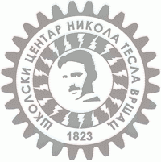
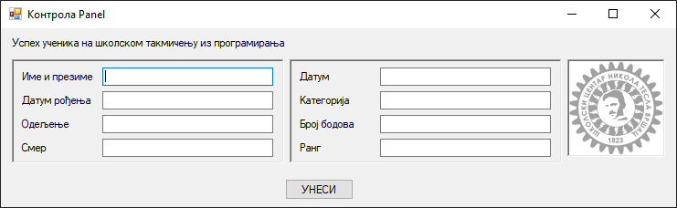
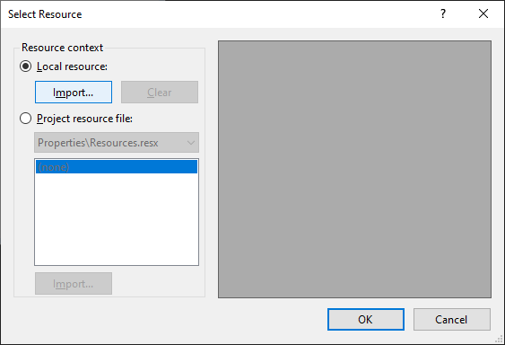
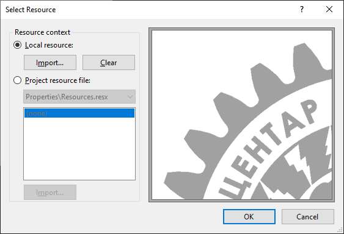
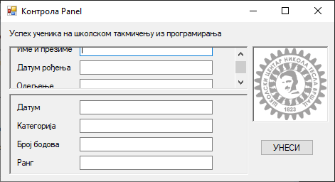
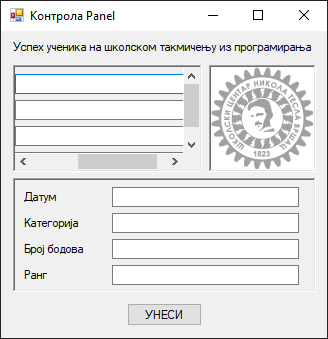

# Панел

Контрола **панел** (енгл. *Panel*) дефинисана је у класи `Panel` у именском
простору `System.Windows.Forms`, односно склопу `System.Windows.Forms.dll`.
Класа `Panel` наслеђује класу `ScrollableControl` која наслеђује класу
`Control`, па због тога контрола панел има основна својства, догађаје и методе
као и остале контроле у *Windows Forms App* пројектима.

Детаљан опис својстава, догађаја и метода класе `Panel` налази се у
званичној [документацији](https://learn.microsoft.com/en-us/dotnet/api/system.windows.forms.panel?view=netframework-4.8).
Има их много и нема потребе наводити их све на овом месту.

Контрола `Panel` користи се за груписања других контрола, тј. служи као
контејнер за друге контроле. Обично се групише више контрола које имају неки
заједничку функционалност. На пример, на обрасцу за слање пакета поштом, на
једном панелу може бити адреса пошиљаоца, на другом адреса примаоца и на трећем
подаци о типу и цени услуге. Тако груписани подаци могу визуелно да помогну
кориснику да се лакше снађе и лакше попуни образац.

Ако контроле унутар панела превазилазе његове димензије, можеш омогућити
својство `AutoScroll` како би се појавиле вертикалне и/или хоризонтале скрол
траке. По овом својству се контрола `Panel` разликује од оквира за групу. Оквир
за групу јесте сличан контроли `Panel`, међутим, само контрола `Panel` може да
има скрол траке, а само оквир за групу има натпис.

## Задатак

Нека је задатак да дизајнираш образац за унос података ученика трећег разреда
који су учествовали на школском такмичењу из програмирања. На обрасцу треба да
постоје поља за унос све групе података...

* Лични подаци:
  * Име и презиме
  * Датум рођења
  * Одељење
  * Смер
* Подаци о успеху на такмичењу:
  * Датум
  * Категорија
  * Број бодова
  * Ранг

...а образац треба да буде "брендиран" логотипом твоје школе, на пример:



Кликом на логотип школе треба да се отвори прегледач у којем је приказан веб
сајт школе.

Елегантно решење овог задатка подразумева коришћење контрола за груписање, на
пример контроле панел. У првом панелу биле би груписане контроле за унос личних
података ученика, а у другом, контроле за унос података о успеху на такмичењу.
На пример:



Превуци први панел на форму и покрени апликацију. Панел којег си поставио јесте
видљив на форми у дизајнеру, али се не види на форми када се покрене
апликација. То значи да треба да промениш својство `BorderStyle` са `None` на
`FixedSigle` или `Fixed3D`. Након тога можеш да поставиш лабеле и оквире за
текст. Исто понови и са другим панелом.

У трећем панелу потребно је приказати логотип школе. Постави трећи панел и
одабери својство `Bacground Image`. Кликни на радио дугме `Local resources`,
кликни на дугме `Import` па одабери слику са логотипом твоје школе...



и на крају кликни на дугме `OK`:



Постави и својство `BorderStyle` трећег панела ако желиш да се приказују оквири
око панела.

Последњи захтев, да се кликом на логотип школе отвори прегледач у којем је
приказан веб сајт школе, можеш реализовати дефинисањем догађаја `Click` на
трећи панел, на пример:

```cs
private void panel3_Click(object sender, EventArgs e)
{
    Process.Start("https://www.teslavs.edu.rs/");
}
```

Ако из неког разлога нема довољно места за приказ свих контрола унутар панела,
потребно је да промениш својство `AutoScroll` на `True`. У следећем примеру...



...на првом панелу појавио се вертикални скрол, а у следећем...



...и вертикални и хоризонтални.
