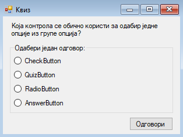
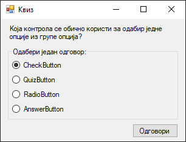
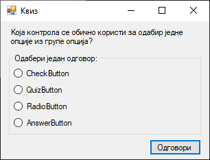
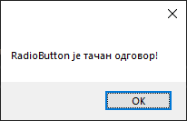
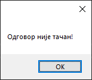
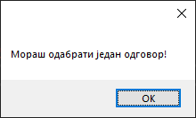

# Радио-дугмe

Контрола **радио-дугме** (енгл. *RadioButton*) дефинисана је у класи
`RadioButton` у именском простору `System.Windows.Forms`, односно склопу
`System.Windows.Forms.dll`. Класа `RadioButton` наслеђује класу `ButtonBase`
која наслеђује класу `Control`, па због тога радио-дугмад имају основна
својства, догађаје и методе као и остале контроле у *Windows Forms App*
пројектима.

Детаљан опис својстава, догађаја и метода класе `RadioButton` налази се у
званичној [документацији](https://learn.microsoft.com/en-us/dotnet/api/system.windows.forms.radiobutton?view=netframework-4.8).
Има их много и нема потребе наводити их све на овом месту.

Ова контрола омогућава одабир једне опције из групе опција када је упарена са
другим радио-дугмадима. Упаривање се врши у контролама попут `GroupBox` или
`Panel` контроле.

Чест пример употребе групе радио-дугмади је у тестовима знања, где постоји само
један тачан одговор, или у обрасцима где се може одабрати само једна опција.

## Задатак

Нека је задатак да креираш једноставну GUI апликацију Квиз у којој се приказује
једно питање и четири понуђена одговора. Кликом на дугме са текстом Одговори,
проверава се тачност одабраног одговора и о томе обавештава корисник.

Креирај нови *Windows Forms App (.NET Framework)* пројекат са формом димензија
320×240, постави контроле као на слици...



...и покрени апликацију:



Десила се једна ситуација која је иритантна за многе програмере. Унапред је одабрано
прво радио-дугме, односно радио-дугме чије својство `TabIndex` има вредност
`0`. Чак ни покушај поништавања одабира приликом учитавања форме неће помоћи...

```cs
private void Form1_Load(object sender, EventArgs e)
{
    rbtOdgovor1.Checked = false;
    rbtOdgovor2.Checked = false;
    rbtOdgovor3.Checked = false;
    rbtOdgovor4.Checked = false;
}
```

...и прво радио-дугме остаће и даље одабрано:


Зашто се ово дешава? Према смерницама за израду *Windows* апликација компаније
*Microsoft*, када постоји група радио-дугмади, увек треба да постоји унапред
одабрано дугме. У овом случају, то би могло да буде дугме са текстом "Не знам
тачан одговор". На теби је да процениш да ли желиш да поштујеш дату смерницу
или да прибегнеш трику и заобиђеш је.

Један начин је да `TabIndex` са вредношћу `0` доделиш другој контроли на форми
чије је својство `TabStop` постављено на `True`. У овом случају то може да буде
дугме. Ако поставиш својство дугмета `TabIndex` на `0`, ни једно радио-дугме
неће бити унапред одабрано:



Други начин је да за сва четири радио-дугмета својство `TabStop` поставиш на
`False`. Овим губиш функционалност тастера `TAB` над радио-дугмадима, што се
свакако не препоручује.

Без обзира да ли желиш да поштујеш дату смерницу или не, треба да имплементираш
функционалност квиза. У овом случају треба да провериш да ли је својство трећег
радио-дугмета `Checked` постављено на `True`:

```cs
private void btnOdgovori_Click(object sender, EventArgs e)
{
    if (rbtOdgovor3.Checked)
    {
        MessageBox.Show(rbtOdgovor3.Text + " је тачан одговор!");
    }
    else if (rbtOdgovor1.Checked || rbtOdgovor2.Checked || rbtOdgovor4.Checked)
    {
        MessageBox.Show("Одговор није тачан!");
    }
    else
    {
        MessageBox.Show("Мораш одабрати један одговор!");
    }
}
```

Ако је корисник одабрао тачан одговор добиће поруку...



...ако је одабрао нетачан одговор добиће поруку...



...и ако није одабрао ни један одговор добиће поруку:



Овако имплементирано решење је можда довољно добро за ову ситуацију. Међутим,
у некој конкретној апликацији за квизове, питање, сет одговора и индекс тачног
одговора учитавали би се из фајла или базе података и динамички смењивали једно
за другим. Како у `RadioButton` контролама не постоји уграђено својство које
директно дефинише индекс радио-дугмета у групи, за имплементацију таквог решења
могао би да користиш листу или низ `RadioButton` контрола заједно са
променљивом у којој се чува индекс тачног одговора.
