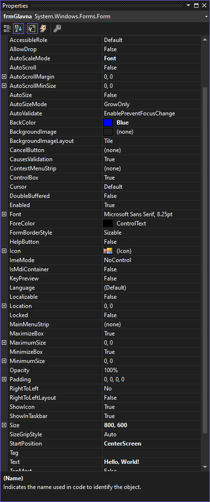

# Својства

У *Windows Forms App (.NET Framework)* пројектима својства (енгл. *Properties*)
представљају карактеристике, односно атрибуте објеката, као што су форме, разне
контроле и други елементи корисничког интерфејса. Својства омогућавају
постављање и приступ вредностима које одређују изглед тих објеката.

Свако својство има гетер и сетер методе које омогућавају читање (`get`) и
постављање (`set`) вредности својства. На пример, својство `Text` може да буде
дефинисано овако:

```cs
public string Text
{
    get { return text; }
    set { text = value; }
}
```

Својства се дефинишу унутар класа и могу бити било ког типа података. На
пример, нека контрола може да има дефинисана својства целобројног типа за
ширину и висину контроле на следећи начин:

```cs
public class NekaKontrola : Control
{
    public int Width { get; set; }
    public int Height { get; set; }
}
```

У претходној лекцији мењао си одређена својства форме у `Properties` прозору
тј. у времену дизајнирања апликације, а дефинисао си и неке догађаје и у тим
догађајима мењао својства форме у коду, тј. у току извршавања програма.

Својства форми контрола у `Properties` прозору организована су по категоријама
*Accessibility*, *Apperance*, *Behavior*... зато што је притиснута икона
`Categorized` на врху `Properties` прозора. Ако ти је лакше да својства тражиш
по абецедном распореду, кликни на икону `Alphabetical` која се налази поред
иконе `Categorized`. (Komentar: prethodne dve recenice vec postoje u prethodnoj lekciji) Корисно је и да знаш да се својства која си мењао
приказују задебљаним фонтом.



Сва својства наведена у `Properties` прозору можеш мењати и у коду, тј. у току
извршавања програма. Има их много, па је препорука да увек користиш доступну
[документацију](https://learn.microsoft.com/en-us/dotnet/api/system.windows.forms?view=netframework-4.8).

Постоји могућност да сâм дефинишеш својства унутар класе коју креираш:

```cs
public class MojaKontrola : Control
{
    private string mojTekst;

    public string MojTekst
    {
        get { return mojTekst; }
        set { mojTekst = nekaVrednost; Invalidate(); }
    }
}
```

Komentar: nije objasnjeno sta radi metoda Invalidate().

Својства се могу повезати са подацима како би аутоматски рефлектовала промене
у подацима. На пример, својство `Text` неке форме може да буде повезано са
пољем `ImeKupca` из табеле `Kupci` у некој бази података, када се подаци из
те табеле учитају у DataSet `ds`, односно у скуп података:

```cs
this.DataBindings.Add(new Binding ("Text", ds, "Kupci.ImeKupca"));
```

Рад са скуповима података и базама података биће тема у IV разреду.
