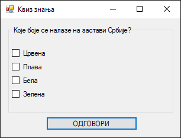

# Задатак: Квиз питања са више тачних одговора

На форму постави оквир за групу, у оквир за групу постави четири оквира за
потврду, а испод оквира за групу постави једно дугме. Креирај апликацију "КВИЗ
ЗНАЊА" у којој питања могу да имају више тачних одговора. Питања и одговори
треба да буду дефинисани у фајлу `pitanja.txt` на следећи начин:

```text
Које боје се налазе на застави Србије?
Црвена
True
Плава
True
Бела
True
Зелена
False
Штиклирај објектно-оријентисане језике.
C
False
C++
True
Java
True
C#
True
```

Нема "полутачних" одговора - на питање може бити дат тачан или нетачан одговор.
Тачан одговор је само ако су сви оквири за потврду штиклирани онако како је то
дефинисано фајлом `pitanja.txt`. На следеће питање прелази се тек када је дат
тачан одговор на тренутно питање.



Komentar: na formi tekst na dugmetu treba da bude ОДГОВОРИ, a ne ОДГОВОР


## Могуће решење задатка

```cs
using System;
using System.Collections.Generic;
using System.Windows.Forms;
using System.IO;

namespace ZadatakCheckBoxKviz
{
    public partial class Form1 : Form
    {
        private List<string[]> pitanja;
        private int trenutnoPitanje;

        public Form1()
        {
            InitializeComponent();
            button1.Text = "ОДГОВОРИ";
            UcitajPitanja();
            PrikaziPitanje(0);
        }

        private void UcitajPitanja()
        {
            pitanja = new List<string[]>();
            string[] linije = File.ReadAllLines("pitanja.txt");
            for (int i = 0; i < linije.Length; i += 9)
            {
                string[] setPitanja = new string[9];
                Array.Copy(linije, i, setPitanja, 0, 9);
                pitanja.Add(setPitanja);
            }
        }

        private void PrikaziPitanje(int redniBroj)
        {
            trenutnoPitanje = redniBroj;
            var q = pitanja[redniBroj];
            groupBox1.Text = q[0];
            checkBox1.Text = q[1];
            checkBox2.Text = q[3];
            checkBox3.Text = q[5];
            checkBox4.Text = q[7];
        }

        private void button1_Click(object sender, EventArgs e)
        {
            var q = pitanja[trenutnoPitanje];
            bool tacno1 = bool.Parse(q[2]);
            bool tacno2 = bool.Parse(q[4]);
            bool tacno3 = bool.Parse(q[6]);
            bool tacno4 = bool.Parse(q[8]);
            bool odgovor1 = checkBox1.Checked;
            bool odgovor2 = checkBox2.Checked;
            bool odgovor3 = checkBox3.Checked;
            bool odgovor4 = checkBox4.Checked;
            bool tacanOdgovor = (tacno1 == odgovor1) &&
                                (tacno2 == odgovor2) &&
                                (tacno3 == odgovor3) &&
                                (tacno4 == odgovor4);
            if (tacanOdgovor)
            {
                MessageBox.Show("Одговор је тачан!");
                int sledecePitanje = trenutnoPitanje + 1;
                if (sledecePitanje < pitanja.Count)
                {
                    checkBox1.Checked = false;
                    checkBox2.Checked = false;
                    checkBox3.Checked = false;
                    checkBox4.Checked = false;
                    PrikaziPitanje(sledecePitanje);
                }
                else
                {
                    MessageBox.Show("Крај квиза");
                    groupBox1.Visible = false;
                    button1.Visible = false;
                }
            }
            else
            {
                MessageBox.Show("Одговор није тачан. Покушај поново.");
            }
        }
    }
}
```

## Додатни задатак

1. Креирај систем за бодовање, тако да се за свако тачно одговорено питање
добија 1 бод. На следеће питање прелази се након одговора на тренутно
питање, без обзира да ли је одговор био тачан или нетачан. Тренутно стање
бодова треба да буде приказано у лабели на форми.
2. Омогући да се сет питања и одговора приказује насумичним (а не увек истим)
редоследом.
3. Обради могуће изузетке, нарочито приликом рада са фајлом.
