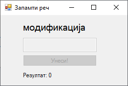
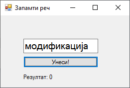

# Задатак: Игра меморије - запамти реч

На форму постави две лабеле, један оквир за текст, једно дугме и један тајмер.
У првој лабели треба да се, на кратак временски период, прикаже насумично
одабрана реч из фајла `reci.txt`. У оквиру за текст корисник треба да унесе
приказану реч и кликне на дугме (или притисне тастер ENTER) да би потврдио
унос. За сваку исправно унету реч треба да се повећава број бодова у другој
лабели.

У фајлу `reci.txt` свака реч треба да буде наведена у новом реду, на пример:

```text
енкапсулација
наслеђивање
полиморфизам
декларација
иницијализација
конструктор
деструктор
преоптерећена
запечаћена
апстракција
класификација
интерфејси
променљиве
компајлери
оптимизација
дебаговање
рефакторисање
модификација
интелигенција
```






## Могуће решење задатка

```cs
using System;
using System.Collections.Generic;
using System.Linq;
using System.Windows.Forms;
using System.IO;

namespace ZadatakZapamtiRec
{
    public partial class Form1 : Form
    {
        private List<string> reci;
        private string rec;
        private Random random;
        private int rezultat;

        public Form1()
        {
            InitializeComponent();
            InicijalizujIgru();
        }

        private void InicijalizujIgru()
        {
            random = new Random();
            reci = new List<string>();
            reci = File.ReadAllLines("reci.txt").ToList();
            rezultat = 0;
            label1.Text = string.Empty;
            textBox1.Visible = false;
            label2.Text = "Резултат: " + rezultat;
            button1.Text = "Почни";
            button1.Focus();
        }

        private void Igraj()
        {
            rec = reci[random.Next(reci.Count)];
            label1.Text = rec;
            timer1.Interval = 2000;
            timer1.Start();
            textBox1 .Enabled = false;
            button1 .Enabled = false;
        }

        private void timer1_Tick(object sender, EventArgs e)
        {
            timer1.Stop();
            label1.Text = string.Empty;
            textBox1.Enabled = true;
            button1.Enabled = true;
            textBox1.Focus();
        }

        private void button1_Click(object sender, EventArgs e)
        {
            if (button1.Text == "Почни")
            {
                button1.Text = "Унеси!";
                textBox1.Visible = true;
                Igraj();
            }
            else
            {
                if (textBox1.Text.Equals(rec, StringComparison.OrdinalIgnoreCase))
                {
                    rezultat++;
                    MessageBox.Show("Тачно!", "Резултат", MessageBoxButtons.OK, MessageBoxIcon.Information);
                }
                else
                {
                    MessageBox.Show("Нетачно. Тачна реч је била: " + rec, "Резултат", MessageBoxButtons.OK, MessageBoxIcon.Information);
                }
                label2.Text = "Резултат: " + rezultat;
                textBox1.Text = string.Empty;
                Igraj();
            }
        }

        private void textBox1_KeyDown(object sender, KeyEventArgs e)
        {
            if (e.KeyCode == Keys.Enter)
            {
                button1.PerformClick();
            }    
        }
    }
}
```

## Додатни задаци

Усаврши игру на следећи начин:

1. Промени систем бодовања тако да се у лабели приказује текст `Резултат: Х од Y`,
где је `Х` број тачно унетих речи, а `Y` укупан број приказаних речи.
2. Дефиниши максимални број задатих речи, нпр. 10, тако да игра има свој крај.
3. Обради могуће изузетке попут учитавања речи из фајла.
