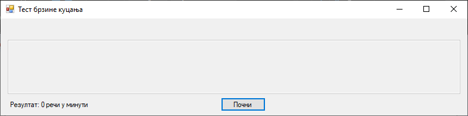
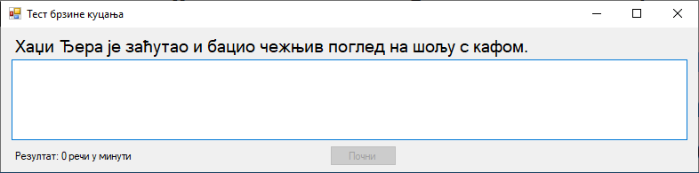
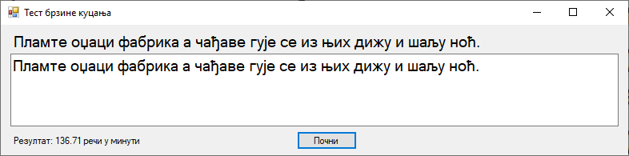

# Задатак: Тест брзине куцања

На форму постави две лабеле, један оквир за текст и једно дугме. Када корисник
кликне на дугме, у првој лабели треба да се прикаже насумично одабрана реченица
из фајла "tekst.txt". Када корисник у оквиру за текст исправно прекуца дату
реченицу, у другој лабели треба да се прикаже брзина куцања корисника.







Реченице у фајлу "tekst.txt" треба да буду унете на следећи начин:

```text
Фијуче ветар у шибљу, леди пасаже и куће иза њих и гунђа у оџацима.
Вук Његошу: "Не ломи џабе перо, дођи тићу, чије се фаце зажељех".
Ниџо, чежњиво гледаш фотељу, а Ђура и Мика хоће позицију себи.
Људи, јазавац Џеф трчи по шуми глођући неко сухо жбуње.
Боја ваше хаљине, госпођице Џафић, тражи да за њу кулучим.
Хаџи-Ђера је заћутао и бацио чежњив поглед на шољу с кафом.
Џабе се зец по Хомољу шуња, чувар Јожеф лако ће и ту да га нађе.
Оџачар Филип шаље осмехе туђој жени, а његова кућа без деце.
Џајић одскочи у аут и избеже ђон халфа Пецеља и његов шамар.
Пламте оџаци фабрика а чађаве гује се из њих дижу и шаљу ноћ.
Ајшо, лепото и чежњо, за љубав срца мога, дођи у Хаџиће на кафу.
Љубазни фењерџија чађавог лица хоће да ми покаже штос.
```
Komentar: Ne bi bilo lose da objasniti klasu Stopwatch koja se koristi u resenju

Komentar: U funkciji Rezultat promenljive imenovati na srpskom, kao u ostatku koda


## Могуће решење задатка

```cs
using System;
using System.Collections.Generic;
using System.Diagnostics;
using System.Linq;
using System.Windows.Forms;
using System.IO;

namespace TestBrzogKucanja
{
    public partial class Form1 : Form
    {
        private List<string> recenice;
        private string recenica;
        private Stopwatch stoperica;
        private Random random;

        public Form1()
        {
            InitializeComponent();
            InicijalizujIgru();
        }

        private void InicijalizujIgru()
        {
            random = new Random();
            recenice = File.ReadAllLines("tekst.txt").ToList();
            label1.Text = string.Empty;
            label2.Text = "Резултат: 0 речи у минути";
            textBox1.Text = string.Empty;
            textBox1.Enabled = false;
            button1.Text = "Почни";
            stoperica = new Stopwatch();
        }

        private void button1_Click(object sender, EventArgs e)
        {
            recenica = recenice[random.Next(recenice.Count)];
            label1.Text = recenica;
            label2.Text = "Резултат: 0 речи у минути";
            textBox1.Enabled = true;
            textBox1.Clear();
            textBox1.Focus();
            button1.Enabled = false;
            stoperica.Reset();
            stoperica.Start();
        }

        private void textBox1_TextChanged(object sender, EventArgs e)
        {
            if (textBox1.Text == recenica)
            {
                stoperica.Stop();
                button1.Enabled = true;
                button1.Focus();
                Rezultat();
            }
        }

        private void Rezultat()
        {
            double elapsedMinutes = stoperica.Elapsed.TotalMinutes;
            int wordCount = recenica.Split(' ').Length;
            double wordsPerMinute = wordCount / elapsedMinutes;
            label2.Text = $"Резултат: {wordsPerMinute:F2} речи у минути";
        }
    }
}
```

## Додатни задатак

1. Омогући да се рад "штоперице" приказује на форми током куцања.
2. Омогући чување 50 последњих резултата у фајлу `score.log`.
3. Обради могуће изузетке, нарочито приликом рада са фајлом.
